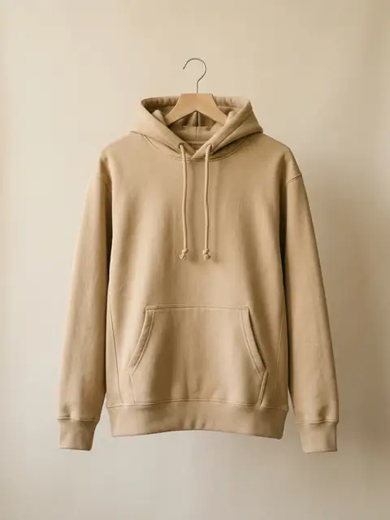

# План v2: код-планировка главной «Культура шитья»

Рабочий документ для сессии, которая строит v2. Задачу ставит `PROMPT.md` (раздел «Промпт»), тексты берутся из `materials/texts.md`. Этот файл говорит, **как** это собрать: файлы, контракт разметки, спеки модулей, порядок работ, проверка. При конфликте приоритет такой: PROMPT.md → texts.md → этот план → DESIGN.md → PRODUCT.md.

> **Статус (2026-09-29): план выполнен.** Страница, три модуля, документы и проверки готовы; `npm run e2e` — 70 проверок, все зелёные. Расхождения кода с текстом плана ниже и причины — в `REPORT-v2.md`. Главные: строка фактов первого экрана — отдельная ячейка сетки, а не внутри `.hero-text` (5.2); H1 — Cormorant 500 (5.2); имена задач на мобильном 32 / 28px вместо 36 (6.3); фон карточки карусели с альфой .99 (6.2).

---

## 0. Как пользоваться

1. Прочитай этот файл целиком, затем `PROMPT.md` (раздел «Промпт») и `materials/texts.md`. `DESIGN.md` открывай как справочник по токенам.
2. Инфраструктура уже готова (раздел 1). Не пересоздавай её.
3. **Раздел 4 «Контракт» — это договор.** На его селекторы, id, имена полей и значения опираются `tools/e2e.mjs` и `tools/shots.mjs`. Если переименовываешь что-то в разметке, поправь оба скрипта в том же коммите.
4. Работай по чек-листу из раздела 9 и отмечай пункты `[x]` прямо в этом файле. Коммить после каждого блока.
5. Критерий готовности: `npm run e2e` зелёный, `node tools/shots.mjs v2` снимает всё без `overflowX` и ошибок, отчёт написан (раздел 11).

Сервер для проверок: `python3 -m http.server 5507 --bind 127.0.0.1` из корня (в облаке запускать в фоне).

---

## 1. Что уже сделано (инфраструктура)

| Что | Где | Статус |
|---|---|---|
| Скилл design-taste-frontend | `.agents/skills/design-taste-frontend`, ссылка в `.claude/skills/` | стоит (DESIGN_VARIANCE 6, MOTION_INTENSITY 5, VISUAL_DENSITY 4) |
| Скилл impeccable | — | **не встал**: `npx impeccable install` дважды получил HTTP 403 от сервера скилла. По промпту работаем без него: проверку critique → audit → harden → adapt → polish проводим вручную по чек-листу из раздела 10.3 |
| Скриншоты «до» | `screenshots/v2/hero-before-{1440x800,1366x650,390x664,360x640}.png` | сняты с исходного v1 |
| Слоты 01–13 | `assets/img/img-01.webp` … `img-13.webp` + `.json` с происхождением | 01, 02 — временные фото v1; 03–13 — заглушки |
| Фото v1, ставшие ненужными | `assets/img/_v1/{dir-opt,dir-exp,stitch}.webp` | перенесены, CREDITS.md обновлён |
| Таблица слотов (единый источник) | `tools/slots.mjs` | готово |
| Генератор заглушек | `tools/placeholders.mjs` | готово (SVG → Chromium → WebP) |
| Приём картинок из `incoming/` | `tools/incoming.mjs` | готово: кадр, WebP, снятие `data-placeholder`, `.json` |
| Запуск браузера | `tools/browser.mjs` | берёт Chromium Playwright, а если его версии нет — `/opt/pw-browsers/chromium` |
| Скриншоты v2 | `tools/shots.mjs` (`before`, `after`, `v2`, `review`, `--only=`) | готово, селекторы по контракту |
| e2e v2 | `tools/e2e.mjs` | написан заранее по контракту (64 проверки) и доведён до зелёного; к нему добавлены проверки крайних вводов: сейчас 70 ok |
| npm-скрипты | `package.json` | `npm run e2e`, `shots` (= v2), `shots:before`, `shots:after`, `review`, `placeholders`, `incoming`, `assets` |
| Каркас модулей | `modules/kc-calc.{css,js}`, `modules/kc-carousel.{css,js}`, `modules/kc-tasks.{css,js}` | шапки с API и токенами, логику писать |
| Режим `?slots` и `data-placeholder` | `script.js`, `styles.css` (блок «v2: слоты») | готово, ждёт `data-slot` в разметке |

---

## 2. Короткий план (то, что промпт просит показать до кода)

```
ДЕСКТОП 1440 (контейнер 1200, 12 кол.)                 390 px
┌ шапка: Услуги Производство Портфолио │ лого │ Прайс Контакты тел ┐┃  ┌ лого        ☎ ≡ ┐
│1 H1 Швейное производство 108 · в Челябинске · Полного цикла 56   │┃  │ H1 47/25, лид 17  │
│  лид 22 · [Рассчитать] [Прайс] ┆Опт от 300┆      ╭арка 01╮       │┃  │ [Рассчитать]      │
│  10+ лет │ 2–3 дня │ 1 цех                        ╰───────╯       │┃  │ [Прайс] ┆бирка┆   │
│2 ◄фото 02 bleed, 6 кол.│ H2 · 3 ¶ · строка Cormorant · .fact 2×2  │┃  │ арка 01 · факты   │
│3A H2 Олеся · ¶¶ · .quote             │ окно --cacao, портрет 03  │┃  │ фото 02 3:2 · H2… │
│3B H2 · лид · 01 Худи 02 Свитшоты … 06 Шорты  (ряд-указатель)     │┃  │ факты 2×2 → 1 кол.│
│   ◁ ▯▯ [ АКТИВНАЯ 3:4 ] ▯▯ ▷  coverflow, счётчик 03 / 06, ← →    │┃  │ H2 · ¶¶ · цитата  │
│шов ┄┄┄ Нужны нестандартные размеры? · моно · [Описать задачу] ┄┄ │┃  │ окно 03           │
│4 H2 · 01 Селлерам WB и OZON →  ┆ картинка 10–13, 4:5, sticky     │┃  │ указатель-скролл  │
│     02 Брендам… 03 Бизнесу… 04 Экспериментальный цех             │┃  │ ▯[карточка]▯ свайп│
│5 H2 · лид · ①┄②┄③┄④┄⑤ путь │ квиз 8 кол. шаг 1/4 ▮▮▯▯ │ «Ваш проект» 4 │┃  │ шов стопкой       │
│6 ███ тёмная полоса --cacao: H2 · текст · [Скачать прайс] [Обсудить] ███│┃ │ аккордеон 01–04   │
└ подвал #kontakty как в v1 ────────────────────────────────────────┘┃  │ путь вертикально  │
                                                          лента ┃      │ квиз + строка-итог│
                                                                       │ финал, подвал     │
                                                                       └ липкая кнопка ────┘
```

**Новые компоненты:** `.hero-facts`, `.fact`, `.quote` (из v1, переезжает в 3A), `.kc-carousel`, `.seam`, `.kc-tasks`, `.path` (путь заказа на `.step-n`), `.kc-calc` (квиз + панель «Ваш проект» + мерная полоса прогресса), `.final` (полоса `--cacao`), окно `#discuss`, режим `?slots`.

**Удаляется из v1:** секции «Два направления» (`#uslugi`), «Полный цикл» (`#cikl`), «Собственный цех» в старом виде (`.prod-grid`, `.spec`), «Посчитаем вашу партию» (`#prais`), окно `#calc` со всей логикой (`setDirection`, `syncQtyHint`, `data-switch-exp`), `data-stub` у «Портфолио». Их смысл переезжает: направления → экраны 4 и 5, цикл → путь заказа на экране 5 и текст экрана 2, цех → экран 2, цитата → экран 3A, расчёт → квиз.

---

## 3. Файлы

| Файл | Что делать |
|---|---|
| `index.html` | Перестроить `<main>`: экраны 1–6 по разделу 5. Шапку, ленту, липкую кнопку, меню, подвал поправить по разделу 5.1. Удалить `#calc`. Добавить `#discuss`. Подключить модули (ниже). Обновить `<meta name="description">` из texts.md |
| `styles.css` | Токены и база остаются. Удалить стили секций v1 (`.directions`, `.dir*`, `.cycle*`, `.steps`, `.spec`, `.prod-grid`, `.window` оставить — он нужен экрану 3A, `.price*`). Добавить стили экранов 1–6 (не модулей). Все новые размеры — через `--fs-*` и медиазапросы 1199/959/639/479 |
| `script.js` | Оставить: заглушки ссылок, шапку, диалоги, формы `price`, липкую кнопку, `?slots`. Удалить логику `#calc`. Добавить форму `discuss` (раздел 5.9), скрытие липкой кнопки у калькулятора и финала (5.1) |
| `modules/kc-carousel.{css,js}` | Модуль «Что мы шьём», раздел 6.2 |
| `modules/kc-tasks.{css,js}` | Модуль «Задачи», раздел 6.3 |
| `modules/kc-calc.{css,js}` | Модуль-квиз, раздел 6.4 |
| `DESIGN.md` | Дописать раздел «v2» (раздел 11). Существующие правила не трогать |
| `PRODUCT.md` | Новая структура страницы и четыре типа клиентов |
| `README.md` | Переписать под v2 (раздел 11) |
| `tools/e2e.mjs`, `tools/shots.mjs` | Уже под v2. Правка — только при осознанном изменении контракта |

Подключение в `<head>`, после `styles.css` и `script.js`:

```html
<link rel="stylesheet" href="modules/kc-carousel.css">
<link rel="stylesheet" href="modules/kc-tasks.css">
<link rel="stylesheet" href="modules/kc-calc.css">
<script src="modules/kc-carousel.js" defer></script>
<script src="modules/kc-tasks.js" defer></script>
<script src="modules/kc-calc.js" defer></script>
```

`preload` картинки первого экрана: заменить `hero-arch.webp` на `img-01.webp`.

---

## 4. Контракт разметки

### 4.1 Секции и окна

| Экран | Элемент | Селектор |
|---|---|---|
| 1 | первый экран | `section.hero`, кнопки в `[data-hero-actions]`, факты `.hero-facts` |
| 2 | производство | `section#proizvodstvo` |
| 3A | основатель | `section#osnovatel` |
| 3B | что мы шьём | `section#portfolio`, внутри `[data-kc-carousel]` |
| шов | нестандартные размеры | `section.seam` |
| 4 | задачи | `section#zadachi`, внутри `[data-kc-tasks]` |
| 5 | расчёт | `section#raschet`, внутри `.path` и `[data-kc-calc]` |
| 6 | финал | `section.final` |
| — | подвал | `footer#kontakty` (как в v1) |
| окна | прайс / обсудить / меню | `dialog#price` (v1 без изменений), `dialog#discuss`, `dialog#menu` |

Окна `#calc` в документе быть не должно.

### 4.2 Переход к калькулятору и предвыбор

Все «Рассчитать стоимость» и действия с предвыбором — это **ссылки** `<a href="#raschet">`: без JS работает якорь, в Тильде тоже. Модуль `kc-calc` перехватывает клик по любому `a[href="#raschet"]` на странице.

| Атрибут | Значения | Эффект |
|---|---|---|
| `data-calc-direction` | `wb` · `brand` · `opt` · `sample` | выбрать направление, показать шаг 1 |
| `data-calc-item` | одно или несколько через пробел: `hoodie ziphoodie sweatshirt shirt dress pants shorts other` | отметить изделия (шаг 2), показать шаг 1 |
| `data-calc-nonstandard` | без значения | отметить «Нестандартные размеры», показать шаг 2, фокус в `#kc-sizes` |

Кто что передаёт:

| Откуда | Разметка |
|---|---|
| Первый экран, лента `.tape`, липкая кнопка, меню, пункт «Прайс» в навигации | `<a href="#raschet">` без предвыбора |
| Карусель, кнопка «Рассчитать» на карточке | 01 → `data-calc-item="hoodie ziphoodie"`, 02 → `sweatshirt`, 03 → `shirt`, 04 → `dress`, 05 → `pants`, 06 → `shorts` |
| Шов, «Описать задачу» | `data-calc-nonstandard` |
| Задачи, ссылки-действия | 01 → `wb`, 02 → `brand`, 03 → `opt`, 04 → `sample` (`data-calc-direction`) |

Поведение перехода, одинаковое для всех источников:

1. `preventDefault`. Если ссылка внутри открытого `<dialog>` (меню), закрыть его **без возврата фокуса на кнопку-открыватель** (см. 5.1), затем продолжить в следующем кадре.
2. Если квиз в состоянии «Заявка принята», сбросить его в чистый шаг 1.
3. Применить предвыбор. Без предвыбора текущий шаг и ответы не трогать.
4. Прокрутить к `[data-kc-calc]`: `scrollIntoView({ block: 'start', behavior })`, `behavior` = `smooth`, а при `prefers-reduced-motion: reduce` — `auto`. Отступ под шапку уже даёт `scroll-padding-top` у `html`.
5. Фокус (`{ preventScroll: true }`): на заголовок активного шага `[data-kc="heading"]` (у него `tabindex="-1"`), а при `data-calc-nonstandard` — на `#kc-sizes`.

### 4.3 Хуки модулей

Корни: `[data-kc-carousel]`, `[data-kc-tasks]`, `[data-kc-calc]`. Внутри JS находит элементы только по `data-kc="роль"` и только внутри своего корня. Классы (`kc-carousel__…`) — для стилей, не для JS.

| Модуль | `data-kc` | Что это |
|---|---|---|
| carousel | `index` | `<ol>` ряда-указателя |
| | `goto` | кнопка пункта, `data-index="0…5"`, у активной `aria-current="true"` |
| | `stage` | сцена с перспективой |
| | `slide` | карточка, `data-index`, `data-pos` (см. 6.2) |
| | `calc-link` | ссылка «Рассчитать» внутри карточки |
| | `prev` / `next` | стрелки; на краях `disabled` |
| | `counter` | «03 / 06», `aria-live="polite" aria-atomic="true"` |
| tasks | `row` | `<li>` строки |
| | `toggle` | `<button aria-expanded aria-controls>` строки |
| | `panel` | раскрывающаяся часть строки (`id` = `aria-controls`) |
| | `stage` | правая колонка с картинками (≥960) |
| | `media` | картинка в `stage`, `data-index="0…3"`, у активной класс `is-active` |
| calc | `step` | `<fieldset>` шага, `data-step="1…4"`, неактивные `hidden` |
| | `heading` | заголовок шага (`h3`, `tabindex="-1"`) |
| | `progress` | текст «Шаг 2 из 4» |
| | `ruler` | мерная полоса прогресса, CSS-переменная `--kc-step` |
| | `prev` / `next` / `submit` | «Назад» / «Далее» / «Получить расчёт» |
| | `qty-wrap` / `models-wrap` | поле количества / «Сколько моделей» (для `sample`) |
| | `qty-quick` | быстрые варианты, `data-value` = 50 · 100 · 300 · 500 · 1000 |
| | `hint` / `switch` | подсказка < 300 и кнопка «Переключить» |
| | `sizes-wrap` | обёртка поля «Опишите размеры или модель» |
| | `summary` | панель «Ваш проект» |
| | `sum` | значение в панели, `data-key` = direction · items · qty · fabric · services · when |
| | `sumline` | строка-итог над кнопками (<960) |
| | `done` | блок «Заявка принята», `tabindex="-1"` |

### 4.4 Поля квиза

| Шаг | Поле | name / id | Значения | Обязательно | Ошибка (id → текст из texts.md) |
|---|---|---|---|---|---|
| 1 | Направление | radio `direction` | `wb` «Партия для WB и OZON» · `brand` «Коллекция бренда» · `opt` «Опт и СТМ» · `sample` «Образец» | да | `#kc-err-direction` → «Выберите, что нужно» |
| 2 | Изделие | checkbox `item` | `hoodie` Худи · `ziphoodie` Зип-худи · `sweatshirt` Свитшот · `shirt` Рубашка · `dress` Платье · `pants` Брюки · `shorts` Шорты · `other` Другое | хотя бы одно | `#kc-err-item` → «Выберите хотя бы одно изделие» |
| 2 | Количество, ед. | number `qty`, `#kc-qty` | целое > 0; быстрые 50 · 100 · 300 · 500 · 1000+ (кнопка «1000+» ставит 1000) | да, кроме `sample` | `#kc-err-qty` → «Укажите количество — можно примерно» |
| 2 | Сколько моделей | radio `models` | `1` · `2-3` «2–3» · `4+` «4 и больше»; по умолчанию `1` | только `sample`, есть значение по умолчанию | — |
| 2 | Нестандартные размеры | checkbox `nonstandard`, `#kc-nonstandard` | — | нет | — |
| 2 | Опишите размеры или модель | textarea `sizes`, `#kc-sizes` | видно, только когда отмечено `nonstandard` | нет | — |
| 3 | Ткань | radio `fabric` | `own` «Своя — давальческое сырьё» (по умолчанию) · `consult` «Нужна консультация по ткани» + `.todo` [уточнить] | есть значение по умолчанию | — |
| 3 | Дополнительно | checkbox `service` | `patterns` Лекала и конструирование · `labels` Бирки и составы · `packaging` Упаковка по ТЗ · `dtf` Печать DTF · `embroidery` Вышивка | нет | — |
| 3 | Когда нужна партия | radio `when` | `asap` Как можно скорее · `month` В течение месяца · `1-2m` Через 1–2 месяца · `later` Пока присматриваюсь | нет | — |
| 4 | Имя | text `name`, `#kc-name` | — | да | `#kc-err-name` → «Напишите, как к вам обращаться» |
| 4 | Телефон или e-mail | text `contact`, `#kc-contact` | телефон: 10–11 цифр (допустимы `+ ( ) - пробел`); e-mail: `x@y.zz` | да | `#kc-err-contact` → «Нужен телефон (10–11 цифр) или e-mail» |
| 4 | Где удобнее общаться | radio `messenger` | `telegram` · `whatsapp` · `max` · `call` «Звонок» | нет | — |
| 4 | Согласие на ПДн | checkbox `consent`, `#kc-consent` | по умолчанию пусто; ссылки на `consent.html` и `privacy.html` | да | `#kc-err-consent` → «Без согласия мы не сможем прислать расчёт» |

Подсказка `[data-kc="hint"]`: видна, если направление `wb` или `opt`, `qty` заполнено и 0 < qty < 300. Текст: «Партии меньше 300 ед. шьём в направлении „Коллекция бренда“». Кнопка `[data-kc="switch"]` «Переключить» ставит `direction=brand`; подсказка гаснет. Это **не ошибка**: «Далее» с qty = 120 пропускает на шаг 3.

### 4.5 Окно «Обсудить задачу» `#discuss`

Форма `<form class="form" data-form="discuss" novalidate>`:

| Поле | name / id | Обязательно | Ошибка |
|---|---|---|---|
| Имя | `name`, `#discuss-name` | да | `#discuss-name-err` → «Напишите, как к вам обращаться» |
| Телефон | `phone`, `#discuss-phone`, `type="tel"` | да, 10–11 цифр | `#discuss-phone-err` → «Нужен телефон (10–11 цифр)» |
| Удобное время | radio `slot`: `09-12` · `12-15` · `15-18` · `18-20`, подпись «(по Москве)» + `.todo` [уточнить часы работы] | нет | — |
| Коротко о задаче | textarea `task` | нет | — |
| Согласие | checkbox `consent` | да | `#discuss-consent-err` → «Отметьте согласие на обработку персональных данных: без него мы не можем принять заявку.» (текст v1) |

Кнопка «Заказать звонок». Успех `[data-done]`: «Спасибо! Перезвоним в выбранное время.» Мессенджеры сверху окна: три ссылки-заглушки `data-stub`.

### 4.6 Картинки-слоты

```html
<figure class="…" data-slot="03">
  
</figure>
```

- `data-slot="NN"` ставится на **обёртку** картинки. Обёртка обязана быть позиционированной (`relative`, `absolute` или `sticky`) своими стилями: к ней крепится бирка режима `?slots`.
- `data-placeholder` стоит на ``, пока в слоте заглушка. Стиль (уже в `styles.css`): без цветокоррекции, `object-fit: contain`, фон `#D5C8B3`. `tools/incoming.mjs` снимает атрибут сам. У 01 и 02 (временные фото) атрибута нет.
- `width`/`height` — по слоту: 01, 02 → `1600×2000`; 03, 10–13 → `1200×1500`; 04–09 → `1200×1600`.
- 01 — `fetchpriority="high"` без `loading`, остальные — `loading="lazy" decoding="async"`.
- Слоты 10–13 встречаются дважды: в `stage` (≥960) и внутри панелей строк (<960). Лишняя копия скрыта `display: none`, а lazy-картинка с `display: none` не грузится.

Alt (русский, по смыслу слота, не по заглушке):

| Слот | alt |
|---|---|
| 01 | Руки швеи ведут ткань под лапкой промышленной швейной машины |
| 02 | Швейный цех: раскройный стол с лекалами, стойки с готовыми изделиями у кирпичной стены (текст v1; поменять вместе с фото) |
| 03 | Олеся Аксенова, основатель «Культуры шитья», у раскройного стола в цехе |
| 04 | Худи из плотного хлопкового футера на деревянной вешалке |
| 05 | Свитшот с круглым вырезом на деревянной вешалке |
| 06 | Хлопковая рубашка свободного кроя на деревянной вешалке |
| 07 | Льняное платье миди на деревянной вешалке |
| 08 | Широкие брюки из хлопкового твила на вешалке с зажимами |
| 09 | Хлопковые шорты на кулиске на вешалке с зажимами |
| 10 | Готовая партия худи в пакетах с бирками, уложенная в коробки |
| 11 | Основательница бренда и технолог обсуждают образец платья на манекене |
| 12 | Стойка с партией одинаковых рубашек разных размеров |
| 13 | Стол конструктора: бумажные лекала, линейка, мел и булавки |

Миниатюры изделий в квизе используют те же файлы 04–09 (кеш браузера), «Зип-худи» — тоже 04, у «Другое» миниатюры нет: пустая клетка со «строчкой».

---

## 5. Экраны

Общее для всех новых секций: класс `.section` (верхняя линия контейнера и ритм `--section` из v1). Сетка 12 колонок, `column-gap: var(--gap)`. На ≤959 — одна колонка. Кикеров над заголовками нет (DESIGN.md запрещает). Заголовки `text-wrap: balance`.

Новые токены, добавить в `:root` и медиазапросы. Стартовые значения, финальные выбирать по скриншотам:

| Токен | 1200+ | 960–1199 | 640–959 | 480–639 | 320–479 | Где |
|---|---|---|---|---|---|---|
| `--fs-xl` | 108 | 92 | 78 | 64 | 47 | «Швейное производство» (было 96/80/74/65/48) |
| `--fs-mid` | 56 | 46 | 39 | 32 | 25 | «Полного цикла под ключ» (было 50/42/39/32/25) |
| `--fs-city` | 17 | 16 | 15 | 14 | 14 | «в Челябинске», моно 500 |
| `--fs-lead` | 22 | 20 | 19 | 18 | 17 | лид (было 20/18/18/17/17) — не забыть, что `--fs-lead` глобальный |
| `--fs-fact` | 44 | 40 | 38 | 36 | 36 | цифра `.fact` |
| `--fs-hero-fact` | 40 | 36 | 36 | 32 | 30 | цифры строки фактов первого экрана |
| `--fs-seam` | 34 | 30 | 28 | 26 | 24 | «Нужны нестандартные размеры?» |

Цифры Cormorant по умолчанию старостильные («3» уходит под строку). Для фактов, счётчиков, номеров карточек и `.fact` ставить `font-variant-numeric: lining-nums`. Телефон в подвале оставить как в v1: его одобрили.

### 5.1 Шапка, лента, липкая кнопка, меню, подвал

- Навигация в шапке: слева «Услуги» `#zadachi`, «Производство» `#proizvodstvo`, «Портфолио» `#portfolio`; справа «Прайс» `#raschet`, «Контакты» `#kontakty`, телефон. То же в `#menu` и в колонке «Разделы» подвала. `data-stub` у «Портфолио» убрать везде.
- Лента: `<a class="tape" href="#raschet" aria-label="Рассчитать стоимость">`. Стиль v1 не меняется (добавить `text-decoration: none`).
- Липкая кнопка: `<a class="btn btn-primary" href="#raschet">Рассчитать стоимость</a>`. Кроме v1-логики (показывается, когда кнопки первого экрана ушли из вида), **скрывается, пока `#raschet` или `.final` в зоне видимости**, иначе она закрывает кнопки квиза. Одно `IntersectionObserver` на три цели.
- Меню: кнопка внизу меню — `<a class="btn btn-primary" href="#raschet">`. Закрытие меню при клике по пункту навигации или по этой кнопке — **без возврата фокуса** на «≡»: в `script.js` перед `close()` обнулить `opener`. Иначе событие `close` вернёт фокус на кнопку меню уже после того, как квиз поставил его на свой заголовок.
- Подвал: как в v1, только ссылки разделов.

### 5.2 Экран 1: доводка, не редизайн

Сохранить: композицию 7 + 5 колонок, арку, формулировку H1 в три уровня, лид, обе кнопки, бирку «Опт от 300 ед.», анимацию загрузки ≤ 900 мс.

```html
<h1 class="hero-title" id="hero-title">
  <span class="ht-line ht-xl">Швейное производство</span>
  <span class="ht-line ht-city">в&nbsp;Челябинске</span>
  <span class="ht-line ht-mid">Полного цикла под&nbsp;ключ</span>
</h1>
<p class="hero-lead">Шьём для локальных брендов и&nbsp;селлеров WB&nbsp;и&nbsp;OZON. Доставка по&nbsp;всей России.</p>
<div class="hero-actions" data-hero-actions>
  <a class="btn btn-primary" href="#raschet">Рассчитать стоимость</a>
  <button class="btn btn-secondary" type="button" data-open="price">Скачать прайс</button>
  <span class="tag">Опт от&nbsp;300&nbsp;ед.</span>
</div>
<dl class="hero-facts">
  <div><dt>10+ лет</dt><dd>шьём в&nbsp;собственном цехе</dd></div>
  <div><dt><span class="nowrap">2–3&nbsp;дня</span></dt><dd>любой образец</dd></div>
  <div><dt>1 цех</dt><dd>от&nbsp;лекал до&nbsp;упаковки</dd></div>
</dl>
```

`<dt>` здесь — цифра (визуально крупно), `<dd>` — подпись. В `dl` порядок «термин → описание» и так читается правильно.

Правила доводки (проверять на `hero-after-*`):

1. **Один фокус.** Путь взгляда: «Швейное производство» → «Полного цикла под ключ» → лид → «Рассчитать стоимость» → арка. Лид — Cormorant **500** (в v1 600 спорил с H1), цвет `--ink`.
2. **Шкала.** Четыре размера: `--fs-xl`, `--fs-mid`, `--fs-lead`, интерфейс 13–14. «в Челябинске» (`--fs-city`, моно 500, `letter-spacing: .04em`) держится ближе к интерфейсу, чем к лиду. Строка фактов вне счёта.
3. **Близость.** Отступы: xl → city 12px, city → mid 20px (внутри H1); H1 → лид ≥ 44px; лид → кнопки ≥ 40px; внутри действий 14–16px. Правило «между группами ≥ 2× внутри группы» соблюдается. «в Челябинске» стоит сразу под «производство» и читается его продолжением. Если на скриншоте это не так, пробовать приём «в Челябинске» на одной базовой линии с концом «производство» (на 1200+ места может не хватить, тогда на следующей строке).
4. **Лид.** Одна фраза абзаца, 45–65 знаков в строке (`max-width` около 30em для Cormorant 22px), максимум 2–3 строки. `WB&nbsp;и&nbsp;OZON` — неразрывно. Убрать `display: block` у половинок лида из v1.
5. **Цифры.** Строка фактов — цифрами. Cormorant 600, `--fs-hero-fact`, `lining-nums`; подписи моно 13px `--muted`; между фактами вертикальные линии 1px `--line`, левый отступ у второго и третьего факта 24px.
6. **Кнопка.** «Рассчитать стоимость» — единственный залитый тёмный элемент в колонке. Смысловых элементов не больше семи: H1, лид, 2 кнопки, бирка, факты, арка.
7. **Начертание дисплея.** Сравнить Cormorant 500 и 600 для `.ht-xl` на 1440 (снять оба варианта во временную папку, выбрать, записать выбор в отчёт).

Строка фактов на десктопе: последний ряд текстовой колонки, прижата к низу экрана. Первый экран `min-height: 100svh` (с фолбэком `100vh`), колонка текста — flex-колонка, факты с `margin-top: auto`. На 1366×650 факты уйдут ниже края — это допустимо, главное — H1 и обе кнопки видны. Если кнопки вытесняются, перенести факты в начало экрана 2 и написать об этом в отчёте. На <960: факты под аркой, 3 колонки от 480px, на 320–479 — три строки «цифра слева, подпись справа» с горизонтальными линиями.

Критерии приёмки в e2e: 1440×800 и 1366×650 — H1 и обе кнопки в окне; 390×664 и 360×640 — H1 и «Рассчитать стоимость».

### 5.3 Экран 2: Производство `#proizvodstvo`

```
1200+:  [фото 02 — кол. 1–6, bleed влево до края окна] [текст — кол. 8–12]
960–1199: фото 1–6 (bleed), текст 7–12
≤959:   фото 3:2 на всю ширину контейнера → текст → .fact 2×2 (≤479: 1 колонка)
```

- Фото: `<figure class="prod-photo" data-slot="02">`, 4:5, `object-fit: cover`. Bleed: `margin-left: calc(-1 * (max(0px, (100vw - var(--tape-w) - 1200px) / 2) + var(--gutter)))`. Влево горизонтальный скролл не возникает, но проверить на 1920 и 1200. На ≤959 bleed отключить, `aspect-ratio: 3 / 2`, `object-position: 50% 50%`. Можно `position: sticky; top: calc(var(--header-h) + 32px)` на ≥960, если текст выше фото (решить по скриншоту).
- H2 «Один цех. Одна ответственность. Один результат.» — три `span` с `display: block`, по фразе на строку, `--fs-h2`. Три абзаца моно `--fs-body`, `max-width: 56ch`, между абзацами 14px. Финальная строка — `<p class="prod-final">`, Cormorant 500, 26px (1200+) / 24 / 22 / 21 / 20, отступ сверху 28px.
- `.fact` — сетка 2×2, `gap: 12px`, отступ сверху 40px:
  ```html
  <ul class="facts">
    <li class="fact fact--main"><span class="fact-n">2–3&nbsp;дня</span><span class="fact-l">любой образец</span></li>
    <li class="fact"><span class="fact-n">от&nbsp;300&nbsp;ед.</span><span class="fact-l">опт для&nbsp;WB&nbsp;и&nbsp;OZON</span></li>
    <li class="fact"><span class="fact-n">Бирки и&nbsp;составы</span><span class="fact-l">упаковка по&nbsp;вашему ТЗ</span></li>
    <li class="fact"><span class="fact-n">DTF и&nbsp;вышивка</span><span class="fact-l">печать и&nbsp;вышивка на&nbsp;ткани</span></li>
  </ul>
  <p class="prod-note">Работаем на&nbsp;давальческом сырье.</p>
  ```
  `.fact`: `padding: 22px 20px 20px`, `min-height: 132px`, flex-колонка, радиус 0, `cursor: default`, без hover. `.fact-n` — Cormorant 600 `--fs-fact`, `line-height: 1`, `lining-nums`. `.fact-l` — моно 13px, `margin-top: auto` (подписи по нижнему краю, в одну линию). `.fact--main` — фон `--ink`, текст `--milk`, подпись `--milk` с непрозрачностью .8 (проверить AA). Остальные — фон `--milk`, `border: 1.5px dashed var(--clay)` по периметру, как `.tag`. `.prod-note` — моно 13px `--muted`, отступ сверху 16px.
- Кнопок нет. Ритм секции тяжелее среднего: `.section.s-prod { --section: 160px }` (1199: 140, 639: 100), как у v1 `.production`.

### 5.4 Экран 3A: Основатель `#osnovatel`

```
1200+:  [текст — кол. 1–7] [окно --cacao с портретом 03 — кол. 8–12]   зеркально экрану 2
≤959:   текст → окно (портрет 4:5, ширина до 460px)
```

- `<h2>Олеся Аксенова</h2>` — `--fs-h2-lg` (раздел доверия), под ним `<p class="founder-role">основатель «Культуры шитья»</p>` моно 13px `--muted`, `letter-spacing: .04em`, отступ 12px.
- Два абзаца моно, `max-width: 58ch`, отступ сверху 32px.
- Цитата — `.quote` из v1 (Cormorant 500 `--fs-quote`, левая линия 4px `--clay`), `margin-top: 48px`:
  ```html
  <blockquote class="quote">
    <p>«Приходите с&nbsp;идеей — я&nbsp;помогу превратить её в&nbsp;готовую партию и&nbsp;проведу вас от&nbsp;первой примерки до&nbsp;отгрузки».</p>
    <footer>Олеся Аксенова, основатель</footer>
  </blockquote>
  ```
- Окно: `<figure class="window" data-slot="03">` — стиль `.window` v1 (фон `--cacao`, padding 28/22/20/14). Внутри заглушка 03 с `data-placeholder`. Сгенерированное лицо не ставить.
- Кнопок нет.

### 5.5 Экран 3B: Что мы шьём `#portfolio`

Заголовок и лид слева (кол. 1–7), под ними модуль `kc-carousel` на всю ширину контейнера. Спека модуля — раздел 6.2.

```
1200+:
H2 Что мы шьём
лид (моно, 2 строки)
01 Худи и зип-худи   02 Свитшоты   03 Рубашки   04 Платья   05 Брюки   06 Шорты      ← ряд-указатель, активный подчёркнут строчкой
        ▯▯▯      ▯▯▯▯▯    ┏━━━━━━━━━━┓    ▯▯▯▯▯      ▯▯▯
        ▯▯▯ -2   ▯▯▯ -1   ┃ ┆04┆      ┃ +1 ▯▯▯      +2 ▯▯▯
        ▯▯▯      ▯▯▯▯▯    ┃  фото 3:4 ┃    ▯▯▯▯▯      ▯▯▯
                          ┃ Рубашки    ┃
                          ┃ [Рассчитать]┃
                          ┗━━━━━━━━━━┛
                                             [←]  03 / 06  [→]
390:
H2, лид; ряд-указатель — горизонтальный скролл одной строкой (без переноса), активный пункт прокручивается в видимость;
карточка по центру (`min(280px, 72vw)`), края соседних; стрелки и счётчик под карточкой.
```

### 5.6 Шов между 3B и 4

```html
<section class="seam" aria-labelledby="seam-title">
  <div class="container">
    <div class="seam-inner">
      <h2 class="seam-title" id="seam-title">Нужны нестандартные размеры?</h2>
      <p class="seam-text">Опишите задачу — уточним детали.</p>
      <a class="btn btn-secondary" href="#raschet" data-calc-nonstandard>Описать задачу</a>
    </div>
  </div>
</section>
```

`.seam` без `.section`: отступ сверху `--section`, снизу 0. `.seam-inner`: фон `--milk`, сверху и снизу пунктир `--stitch` (`background: var(--stitch) top left / 100% 2px no-repeat, var(--stitch) bottom left / 100% 2px no-repeat, var(--milk)`), padding 28px 32px, одна строка: `display: flex; align-items: center; gap: 24px`, заголовок Cormorant 600 `--fs-seam`, текст моно `--muted`, кнопка справа (`margin-left: auto`). ≤959: стопкой, кнопка на всю ширину на ≤639.

### 5.7 Экран 4: Задачи `#zadachi`

H2 «Ваша задача определяет решение» (`--fs-h2`, слева). Под ним модуль `kc-tasks`, раздел 6.3.

```
1200+:  [список — кол. 1–7]                                  [картинка 4:5 — кол. 8–12, sticky]
        ─────────────────────────────────────────────
        01  Селлерам WB и OZON                     →   ← активна: номер и стрелка --clay
            Задача  отшить партию к поставке…
            Решение опт от 300 ед., бирки…
            Рассчитать партию →
        ─────────────────────────────────────────────
        02  Брендам одежды                         →
        ─────────────────────────────────────────────
        03  Бизнесу: опт и СТМ                     →
        ─────────────────────────────────────────────
        04  Экспериментальный цех                  →
        ─────────────────────────────────────────────
≤959:   аккордеон; в раскрытой строке сверху картинка 3:2, потом «Задача», «Решение», ссылка
```

### 5.8 Экран 5: От идеи до реализации `#raschet`

- H2 «От идеи до реализации» (`--fs-h2`), лид: «Ответьте на четыре вопроса — посчитаем стоимость и пришлём расчёт» + `<span class="todo">[уточнить срок]</span>`.
- Путь заказа `.path` — `<ol>` из пяти шагов, бейджи `.step-n` (v1: 40×40, `--clay`, цифры `--milk`), соединены пунктиром `--stitch` между бейджами (псевдоэлемент у `li`, по центру высоты бейджа). Подпись шага моно 13px под бейджем; у шага 2 вторая строка «2–3 дня» `--muted`. 1200+: 5 колонок в ряд. ≤959: вертикально, бейдж слева, пунктир вертикальный (`repeating-linear-gradient(180deg, …)`), шаг ≤ 56px высотой.
- Ниже модуль `kc-calc`, раздел 6.4. Ритм секции компактнее: `.section.s-calc { --section: 96px }` (1199: 88, 639: 64).
- Секция — цель якоря `#raschet`, но фокус и прокрутка идут к `[data-kc-calc]` (см. 4.2).

### 5.9 Экран 6: Финал

Делаем тёмной полосой — страница заканчивается увереннее, и финал отделён от подвала без лишней линии. Если на скриншоте хуже, откатить на светлый вариант и записать в отчёт.

```html
<section class="final" aria-labelledby="final-title">
  <div class="container final-inner">
    <h2 id="final-title">Обсудим вашу задачу</h2>
    <p>Пришлём прайс на&nbsp;телефон или e-mail или созвонимся в&nbsp;удобное время.</p>
    <div class="final-actions">
      <button class="btn btn-on-dark" type="button" data-open="price">Скачать прайс</button>
      <button class="btn btn-on-dark-outline" type="button" data-open="discuss">Обсудить задачу</button>
    </div>
    <p class="final-direct">Или напишите напрямую: <a href="#" data-stub>Telegram</a> <a href="#" data-stub>WhatsApp</a> <a href="#" data-stub>Max</a></p>
  </div>
</section>
```

- `.final`: `margin-top: var(--section)`, фон `--cacao`, текст `--milk`, padding 112/96/88/72/64. На всю ширину окна (минус ленту). H2 `--fs-h2`. Текст моно, `rgba(242,236,226,.8)` — проверить AA на `--cacao`.
- Кнопки инвертированы: главная — фон `--milk`, текст `--ink`, hover фон `#E6DECE`; вторичная — прозрачная, контур и текст `--milk`, hover фон `rgba(242,236,226,.1)`.
- Фокус на тёмном: `outline-color: var(--milk)` (глина на какао не даёт 3:1). Ссылки мессенджеров — `--milk`, подчёркивание `rgba(242,236,226,.5)`.
- Подвал после финала: у `.site-footer` убрать `margin-top`, у его контейнера верхнюю линию оставить.
- Окно `#discuss` — `dialog.modal.modal--small`, форма из 4.5. Удобное время — `.seg` на 4 варианта (2×2). Поведение как у `#price`: `showModal`, Esc, клик по фону, возврат фокуса на кнопку. Валидация — общая функция форм в `script.js`, расширить на поле `phone`: только телефон, 10–11 цифр.

---

## 6. Модули

### 6.1 Общие правила изоляции (для переноса в Тильду блоком T123)

- Весь CSS модуля — в `modules/kc-*.css`, все селекторы начинаются с `.kc-имя`. Токены — **свои**, на корне модуля (`.kc-calc { --kc-ink: #2E2520; … }`), значения совпадают с DESIGN.md. Глобальные `--fs-*`, `.btn`, `.tag`, `.seg` модуль не использует: нужные стили дублирует внутри своего префикса (`.kc-calc__btn`). Шрифты — по имени семейства (`Cormorant`, `IBM Plex Mono`): на сайте они уже подключены, в Тильде их даёт Google Fonts.
- JS модуля — IIFE без глобальных переменных, ищет свои корни `document.querySelectorAll('[data-kc-…]')`, работает с несколькими экземплярами. Общих утилит между модулями нет, связь только через разметку (`a[href="#raschet"]` + `data-calc-*`).
- Каждый модуль сам проверяет `matchMedia('(prefers-reduced-motion: reduce)')` и `(hover: hover) and (pointer: fine)` и подписывается на их изменения.
- Движение 150–300 мс, `ease-out` (`cubic-bezier(.2, .7, .2, 1)`), без пружин. При reduce — без переходов.
- Брейкпоинты в модулях те же: 1199 / 959 / 639 / 479.

### 6.2 `kc-carousel` — 3D-карусель «Что мы шьём»

Разметка:

```html
<div class="kc-carousel" data-kc-carousel role="region" aria-roledescription="карусель" aria-label="Что мы шьём">
  <ol class="kc-carousel__index" data-kc="index">
    <li><button class="kc-carousel__goto" type="button" data-kc="goto" data-index="0" aria-current="true"><span>01</span> Худи и&nbsp;зип-худи</button></li>
    <!-- 02 Свитшоты · 03 Рубашки · 04 Платья · 05 Брюки · 06 Шорты -->
  </ol>
  <div class="kc-carousel__stage" data-kc="stage">
    <article class="kc-carousel__slide" data-kc="slide" data-index="0" data-pos="0"
             role="group" aria-roledescription="слайд" aria-label="1 из 6: Худи и зип-худи">
      <div class="kc-carousel__card">
        <figure class="kc-carousel__media" data-slot="04">
          
          <span class="kc-carousel__tag" aria-hidden="true">01</span>
        </figure>
        <h3 class="kc-carousel__title">Худи и&nbsp;зип-худи</h3>
        <a class="kc-carousel__cta" href="#raschet" data-kc="calc-link" data-calc-item="hoodie ziphoodie">Рассчитать</a>
      </div>
    </article>
    <!-- ещё 5 слайдов -->
  </div>
  <div class="kc-carousel__controls">
    <button class="kc-carousel__arrow" type="button" data-kc="prev" aria-label="Предыдущее изделие">…svg ←…</button>
    <p class="kc-carousel__counter" data-kc="counter" aria-live="polite" aria-atomic="true">01 / 06</p>
    <button class="kc-carousel__arrow" type="button" data-kc="next" aria-label="Следующее изделие">…svg →…</button>
  </div>
</div>
```

Геометрия задаётся в CSS по `data-pos`, JS только расставляет позиции. `data-pos` = индекс слайда − активный индекс, ограниченный `-3…3` (`-3` и `3` значат «скрыт»).

| `data-pos` | 1200+ (карточка 360px) | 640–1199 (карточка 320px) | <640 (карточка `min(280px, 72vw)`) |
|---|---|---|---|
| 0 | `translateX(0) translateZ(0) rotateY(0)`, brightness 1, z 5 | то же | то же |
| ±1 | `translateX(±64%) translateZ(-160px) rotateY(∓30deg)`, brightness .82 | `±60%`, `-140px`, `∓28deg` | `±88%`, `-80px`, `∓15deg`, brightness .85 |
| ±2 | `translateX(±114%) translateZ(-280px) rotateY(∓32deg)`, brightness .62 | `±106%`, `-240px`, `∓30deg` | скрыт |
| ±3 | `opacity: 0; pointer-events: none` (дальше за ±2) | то же | — |

- Сцена: `perspective: 1200px` (<640: 900px), `position: relative`, высота = высота карточки + запас (`calc(var(--kc-card-w) * 4 / 3 + 120px)`), `overflow: clip` — без горизонтального скролла страницы. Слайды — `position: absolute; left: 50%; width: var(--kc-card-w); margin-left: calc(var(--kc-card-w) / -2)`. Переход: `transform .3s, filter .3s, opacity .3s` с `ease-out`.
- Карточка: фон `--milk`, картинка 3:4. Номер — бирка (`.kc-carousel__tag`): моно 500 13px, фон `--milk`, `1.5px dashed --clay`, в левом верхнем углу картинки с отступом 12px, «вшитый ярлык». Название — Cormorant 600, 32/30/28/28/28px, `padding: 16px 20px 0`. Кнопка «Рассчитать» — только у активной (`[data-pos="0"]`), у остальных `visibility: hidden`: вторичная кнопка 44px, контур `--ink`.
- Наклон за курсором: только `(hover: hover) and (pointer: fine)` и без reduce. `pointermove` по активной карточке → `--tilt-x/--tilt-y` в диапазоне ±5deg, `.kc-carousel__card { transform: perspective(900px) rotateX(var(--tilt-y)) rotateY(var(--tilt-x)) }`, `transition: transform .15s`; на `pointerleave` — ноль.
- Управление:
  - стрелки ± 1; на краях `disabled` (карусель без закольцовки — счётчик «06 / 06» честный);
  - клик по неактивной карточке → она становится активной (клик ловится на `slide`, не на ссылке);
  - `goto` в ряду-указателе;
  - ← → на клавиатуре, когда фокус внутри корня (слушать `keydown` на корне, не на `document`);
  - свайп и перетаскивание: `pointerdown` на сцене → `pointermove` → на `pointerup` сдвиг > 40px → ±1; во время перетаскивания `touch-action: pan-y` у сцены, чтобы вертикальная прокрутка страницы работала; после перетаскивания подавить `click`. У картинок `draggable="false"`, у сцены `user-select: none` и `-webkit-user-drag: none`, иначе браузерный drag картинки перехватит указатель.
- Доступность: у неактивных слайдов `aria-hidden="true"` и `tabindex="-1"` у ссылки; у активного — снять оба. Счётчик — живой регион, текст «NN / 06». У `goto` активного — `aria-current="true"`, у остальных атрибута нет. Автопрокрутки нет.
- `prefers-reduced-motion: reduce`: сцена становится плоским рядом `display: flex; overflow-x: auto; scroll-snap-type: x mandatory; gap: 16px; perspective: none; height: auto`, слайды `position: static; flex: 0 0 var(--kc-card-w); transform: none; filter: none; opacity: 1; scroll-snap-align: center`. Все слайды без `aria-hidden`, все ссылки в табуляции, кнопка «Рассчитать» видна на каждой карточке. Стрелки, `goto` и клавиши прокручивают ряд к карточке (`scrollTo({ left, behavior: 'auto' })`), активный индекс определяется по прокрутке (ближайшая к центру карточка, `scroll` с `requestAnimationFrame`), счётчик и `aria-current` обновляются.
- Ряд-указатель: моно 13px, пункты 44px высотой, между пунктами 28px; активный подчёркнут пунктиром `--stitch` 2px снизу; hover — `text-decoration-color: --clay`. <960: одна строка с горизонтальной прокруткой (`overflow-x: auto; scrollbar-width: none`), активный пункт `scrollIntoView({ inline: 'nearest', block: 'nearest' })`.
- Стрелки: квадратные 48×48, контур `1px --ink`, радиус 0, иконка-стрелка svg 20px, hover фон `rgba(46,37,32,.08)`, `disabled` — непрозрачность .35 и `cursor: default`.

### 6.3 `kc-tasks` — список задач

Выбор паттерна: **кнопки-раскрывашки с `aria-expanded`** (accordion), а не tabs. Причины (записать в отчёт): одна и та же разметка работает и как ховер-список на десктопе, и как аккордеон на мобильном; ссылка-действие внутри раскрытой строки остаётся в естественном порядке табуляции; паттерн tabs требует навигации стрелками и `tabpanel`, отделённого от вкладок, а на мобильном панель должна стоять внутри строки.

```html
<div class="kc-tasks" data-kc-tasks>
  <ol class="kc-tasks__list">
    <li class="kc-tasks__row is-open" data-kc="row">
      <h3 class="kc-tasks__h">
        <button class="kc-tasks__toggle" type="button" data-kc="toggle" id="kc-task-1-btn" aria-expanded="true" aria-controls="kc-task-1">
          <span class="kc-tasks__n">01</span>
          <span class="kc-tasks__name">Селлерам WB&nbsp;и&nbsp;OZON</span>
          <span class="kc-tasks__arrow" aria-hidden="true">→</span>
        </button>
      </h3>
      <div class="kc-tasks__panel" id="kc-task-1" role="region" aria-labelledby="kc-task-1-btn" data-kc="panel">
        <div class="kc-tasks__panel-in">
          <figure class="kc-tasks__media-m" data-slot="10"></figure>
          <dl class="kc-tasks__dl">
            <div><dt>Задача</dt><dd>Отшить партию к&nbsp;поставке и&nbsp;не&nbsp;сорвать сроки.</dd></div>
            <div><dt>Решение</dt><dd>Опт от&nbsp;300&nbsp;ед., бирки, составы и&nbsp;упаковка по&nbsp;вашему ТЗ, отправка любой транспортной компанией.</dd></div>
          </dl>
          <a class="kc-tasks__action" href="#raschet" data-calc-direction="wb">Рассчитать партию <span aria-hidden="true">→</span></a>
        </div>
      </div>
    </li>
    <!-- 02 Брендам одежды (11, brand, «Рассчитать коллекцию»; в решении «от [уточнить минимум] ед.» → .todo)
         03 Бизнесу: опт и СТМ (12, opt, «Обсудить объём»)
         04 Экспериментальный цех (13, sample, «Заказать образец») -->
  </ol>
  <div class="kc-tasks__stage" data-kc="stage">
    <figure class="kc-tasks__media is-active" data-kc="media" data-index="0" data-slot="10"></figure>
    <figure class="kc-tasks__media" data-kc="media" data-index="1" data-slot="11" aria-hidden="true"></figure>
    <!-- 12, 13 -->
  </div>
</div>
```

- Раскладка ≥960: сетка 12 колонок модуля, список — кол. 1–7, сцена — кол. 8–12, `position: sticky; top: calc(76px + 32px)`, картинки 4:5 одна на другой (`grid-area: 1 / 1`), активная `opacity: 1`, остальные 0, `transition: opacity .25s ease-out`. `.kc-tasks__media-m` скрыт.
- <960: сцена скрыта, в раскрытой строке сверху `.kc-tasks__media-m` 3:2 (`aspect-ratio: 3/2; object-fit: cover`).
- Строка: кнопка на всю ширину, `min-height: 88px` (≤639: 72px), сетка `56px 1fr 32px`. Номер моно 13px `--muted`, название Cormorant 600 44/40/38/36/36px, стрелка 24px. Линии 1px `--line` между строками и под последней. Активная (`.is-open`): номер и стрелка `--clay`, стрелка поворачивается на 90° на <960 (как «раскрыто»).
- Панель: `display: grid; grid-template-rows: 0fr` → у `.is-open` `1fr`, `transition: grid-template-rows .25s ease-out`, внутренний блок `overflow: hidden; min-height: 0`. Свёрнутые панели получают `inert` (выпадают из табуляции и из дерева доступности). Отступ панели слева = ширина колонки номера (56px), чтобы текст шёл под названием. `dt` — моно 13px `--muted`, `dd` — моно `--fs-body`, пары в 2 колонки `96px 1fr`. Ссылка-действие — моно 500 14px, подчёркивание `--clay`, 44px высотой.
- Поведение:
  - по умолчанию открыта строка 01;
  - ≥960 и `(hover: hover)`: `pointerenter` на строке и `focusin` на кнопке делают строку активной; клик тоже активирует, но не закрывает — на десктопе всегда открыта ровно одна;
  - ≥960 без hover (планшет с тачем): клик активирует;
  - <960: клик переключает, открыта максимум одна (можно закрыть все);
  - смена активной: `aria-expanded`, `.is-open`, `inert`, у `media` — `is-active` и `aria-hidden`;
  - переход через брейкпоинт (`matchMedia('(min-width: 960px)')` → `change`): на десктопе, если ничего не открыто, открыть 01.

### 6.4 `kc-calc` — квиз «Рассчитать стоимость»

Раскладка: ≥960 — сетка 12 колонок модуля: форма кол. 1–8, панель «Ваш проект» кол. 9–12, `position: sticky; top: calc(76px + 24px)`. <960 — панель скрыта, над кнопками «Назад / Далее» строка-итог `[data-kc="sumline"]` (моно 13px `--muted`, одна-две строки: «Партия для WB и OZON · Худи, Свитшот · 500 ед.»).

Каркас:

```html
<div class="kc-calc" data-kc-calc>
  <form class="kc-calc__form" novalidate>
    <div class="kc-calc__head">
      <p class="kc-calc__progress" data-kc="progress">Шаг 1 из&nbsp;4</p>
      <div class="kc-calc__ruler" data-kc="ruler" style="--kc-step: 1" aria-hidden="true"><span></span><span></span><span></span><span></span></div>
    </div>

    <fieldset class="kc-calc__step" data-kc="step" data-step="1" aria-describedby="kc-err-direction">
      <legend><h3 class="kc-calc__q" data-kc="heading" tabindex="-1">Что нужно?</h3></legend>
      <div class="kc-calc__cards kc-calc__cards--2">
        <label class="kc-calc__card"><input type="radio" name="direction" value="wb"><span><b>Партия для&nbsp;WB и&nbsp;OZON</b><small>от&nbsp;300&nbsp;ед.</small></span></label>
        <label class="kc-calc__card"><input type="radio" name="direction" value="brand"><span><b>Коллекция бренда</b><small>малые партии</small></span></label>
        <label class="kc-calc__card"><input type="radio" name="direction" value="opt"><span><b>Опт и&nbsp;СТМ</b><small>от&nbsp;300&nbsp;ед.</small></span></label>
        <label class="kc-calc__card"><input type="radio" name="direction" value="sample"><span><b>Образец</b><small>за&nbsp;2–3&nbsp;дня</small></span></label>
      </div>
      <p class="kc-calc__err" id="kc-err-direction" hidden>Выберите, что нужно</p>
    </fieldset>

    <fieldset class="kc-calc__step" data-kc="step" data-step="2" hidden>
      <legend><h3 class="kc-calc__q" data-kc="heading" tabindex="-1">Изделие и&nbsp;количество</h3></legend>
      <fieldset class="kc-calc__group" aria-describedby="kc-err-item">
        <legend>Изделие <small>можно несколько</small></legend>
        <div class="kc-calc__items">
          <label class="kc-calc__item"><input type="checkbox" name="item" value="hoodie"><span>Худи</span></label>
          <!-- ziphoodie (04) · sweatshirt (05) · shirt (06) · dress (07) · pants (08) · shorts (09) · other (без картинки) -->
        </div>
        <p class="kc-calc__err" id="kc-err-item" hidden>Выберите хотя бы одно изделие</p>
      </fieldset>
      <div class="kc-calc__field" data-kc="qty-wrap">
        <label for="kc-qty">Количество, ед.</label>
        <input id="kc-qty" name="qty" type="number" inputmode="numeric" min="1" step="1" aria-describedby="kc-err-qty">
        <div class="kc-calc__quick">
          <button type="button" data-kc="qty-quick" data-value="50">50</button> … <button type="button" data-kc="qty-quick" data-value="1000">1000+</button>
        </div>
        <p class="kc-calc__err" id="kc-err-qty" hidden>Укажите количество — можно примерно</p>
      </div>
      <div class="kc-calc__hint" data-kc="hint" hidden>
        <p>Партии меньше 300&nbsp;ед. шьём в&nbsp;направлении «Коллекция бренда».</p>
        <button type="button" data-kc="switch">Переключить</button>
      </div>
      <fieldset class="kc-calc__group" data-kc="models-wrap" hidden>
        <legend>Сколько моделей</legend> <!-- radio models: 1 (checked) · 2-3 · 4+ -->
      </fieldset>
      <label class="kc-calc__check"><input type="checkbox" name="nonstandard" id="kc-nonstandard"><span>Нестандартные размеры</span></label>
      <div class="kc-calc__field" data-kc="sizes-wrap" hidden>
        <label for="kc-sizes">Опишите размеры или модель</label>
        <textarea id="kc-sizes" name="sizes" rows="3"></textarea>
      </div>
    </fieldset>

    <!-- шаг 3: fabric / service / when; шаг 4: name / contact / messenger / consent — по таблице 4.4 -->

    <div class="kc-calc__nav">
      <p class="kc-calc__sumline" data-kc="sumline"></p>
      <button class="kc-calc__btn kc-calc__btn--ghost" type="button" data-kc="prev" hidden>Назад</button>
      <button class="kc-calc__btn" type="button" data-kc="next">Далее</button>
      <button class="kc-calc__btn" type="submit" data-kc="submit" hidden>Получить расчёт</button>
    </div>
  </form>

  <div class="kc-calc__done" data-kc="done" tabindex="-1" hidden>
    <h3>Заявка принята.</h3>
    <p>Пришлём расчёт <span class="todo">[уточнить срок]</span> туда, где вам удобнее.</p>
    <button class="kc-calc__btn" type="button" data-open="price">Скачать прайс</button>
  </div>

  <aside class="kc-calc__panel" data-kc="summary" aria-label="Ваш проект">
    <h3>Ваш проект</h3>
    <dl>
      <div><dt>Направление</dt><dd data-kc="sum" data-key="direction">—</dd></div>
      <div><dt>Изделия</dt><dd data-kc="sum" data-key="items">—</dd></div>
      <div><dt>Количество</dt><dd data-kc="sum" data-key="qty">—</dd></div>
      <div><dt>Ткань</dt><dd data-kc="sum" data-key="fabric">—</dd></div>
      <div><dt>Услуги</dt><dd data-kc="sum" data-key="services">—</dd></div>
      <div><dt>Срок</dt><dd data-kc="sum" data-key="when">—</dd></div>
    </dl>
    <p>Точную стоимость посчитает технолог: цена зависит от&nbsp;модели, ткани и&nbsp;тиража.</p>
  </aside>
</div>
```

Кнопка «Скачать прайс» в состоянии успеха открывает окно `#price` из v1 через `data-open="price"`. Это общий обработчик `script.js`, модуль его не знает. В Тильде это будет ссылка на попап прайса.

Логика (`modules/kc-calc.js`):

- Состояние живёт в самой форме: шаги не удаляются из DOM, только `hidden`, поэтому ответы сохраняются при «Назад / Далее». Панель пересчитывается из `FormData` на каждом `input` и `change`.
- `show(n)`: скрыть все шаги, показать `n`, обновить `progress` («Шаг n из 4»), `--kc-step` у `ruler`, кнопки (`prev` скрыта на шаге 1, `next` скрыта на шаге 4, `submit` виден только на шаге 4), фокус на `heading` шага (кроме случая `nonstandard`, см. 4.2). Прокрутка к верху модуля, только если его верх ушёл выше шапки.
- `validate(n)`: правила из 4.4. Ошибка: показать `.kc-calc__err`, `aria-invalid="true"` на поле (для групп — на первом `input` группы), фокус на первое невалидное поле. Ошибка гаснет, как только поле исправлено (`input` / `change`). «Далее» никогда не блокируется молча и не бывает `disabled`.
- `next`: `validate(cur)` → `show(cur + 1)`. `prev`: `show(cur - 1)` без проверки.
- `submit`: проверить шаги 1–4 по порядку; на первом невалидном — `show(k)` и фокус в поле. Всё валидно → `// TODO: отправка (Тильда: форма-квиз → почта + Telegram)`, форма `hidden`, `done` виден и получает фокус. Панель остаётся.
- Режим `sample`: `qty-wrap` и `hint` скрыты, `models-wrap` виден; в панели «Количество» = «Моделей: 2–3». Иначе наоборот; в панели «500 ед.».
- `nonstandard`: показать и скрыть `sizes-wrap`. В панели к изделиям дописать «нестандартные размеры».
- Подсказка < 300 и «Переключить» — см. 4.4. После «Переключить» фокус на радио `brand` не переносить: остаться на шаге 2 и сказать об изменении через текст подсказки (подсказка исчезает, в панели меняется направление). Панель — не живой регион, чтобы не шуметь.
- Быстрые варианты количества: клик ставит `qty` и шлёт событие `input`.
- `reset()`: `form.reset()`, все ошибки скрыть, `show(1)` без фокуса, `done` скрыть, форму показать.
- Перехват `a[href="#raschet"]` — по 4.2. Один обработчик `click` на `document` (делегирование), берёт первый корень `[data-kc-calc]`.

Визуал:

- Карточки-радио `kc-calc__card` — по мотиву `.seg-opt` из v1: контур `1px --line-strong`, `min-height: 64px`, padding 14px 16px, заголовок моно 500 15px, подпись моно 12px `--muted`; hover — контур `--ink`; выбрана — контур `--clay` + `inset 0 0 0 1px --clay`; фокус — `outline 2px --clay`. Направления 2×2 (≤479: 1 колонка).
- Изделия `kc-calc__item`: сетка 4×2 (≤639: 2 колонки, 4 ряда), миниатюра 3:4 ширина 100% клетки (десктоп ≈ 110px), подпись под ней, чекбокс-квадрат 18px в правом верхнем углу (стиль `.check` v1). «Другое» — клетка той же высоты с пунктирной рамкой `--clay` вместо картинки.
- Поля — как `.field` v1 (50px, `--milk`, контур `--line-strong`, ошибка — `--clay` + inset). Быстрые варианты — кнопки-чипы 44px, контур `--line-strong`, моно 13px; активный (значение совпадает) — контур `--clay`.
- Подсказка — `.hint` v1: фон `--sage-bg`, пунктир `--olive`, кнопка-ссылка с подчёркиванием `--clay`.
- Мерная полоса `ruler`: высота 12px, 4 сегмента с промежутком 4px; по сегментам — деления сантиметровой ленты (`repeating-linear-gradient` каждые 8px короткие, начало сегмента длинное), фон пройденных и текущего сегмента `--clay`, будущих — `--line`. Переход ширины/цвета 250 мс.
- Кнопки `kc-calc__btn`: копия `.btn-primary` v1 (52px, моно 500 14px, `letter-spacing: .05em`), `--ghost` — копия `.btn-secondary`. В `nav`: «Назад» слева, «Далее / Получить расчёт» справа; <640 — обе на всю ширину, «Далее» сверху.
- Панель: фон `--milk`, сверху пунктир `--stitch`, padding 24px, заголовок Cormorant 600 24px, `dt` моно 12px `--muted`, `dd` Cormorant 500 20px `--cacao` (как `.spec dd` v1), пустое значение «—» `--muted`. Сноска моно 12px `--muted`.

---

## 7. Картинки: что уже есть и как менять

| Слот | Файл | Где | Пропорции | Статус |
|---|---|---|---|---|
| 01 | `img-01.webp` | Экран 1, арка | 4:5 | временное фото v1 |
| 02 | `img-02.webp` | Экран 2, цех | 4:5 (моб. 3:2) | временное фото v1 |
| 03 | `img-03.webp` | Экран 3A, Олеся | 4:5 | заглушка (только настоящее фото) |
| 04–09 | `img-04…09.webp` | Экран 3B, карусель + миниатюры квиза | 3:4 | заглушки |
| 10–13 | `img-10…13.webp` | Экран 4, задачи | 4:5 (моб. 3:2) | заглушки |

- Цветокоррекция `filter: saturate(.92) sepia(.06)` — на все `img` слотов, кроме `[data-placeholder]` (правило уже в `styles.css`).
- `?slots` — бирка с номером на каждом `[data-slot]` (уже в `script.js` + `styles.css`).
- Замена картинок из `incoming/` по команде «Новые картинки в incoming»: `node tools/incoming.mjs --dry` → посмотреть каждую картинку (Read) и чек-лист из PROMPT.md → `node tools/incoming.mjs` → CREDITS.md + таблица слотов в README → `node tools/shots.mjs v2 --only=<экран>` → показать скриншоты → коммит.

---

## 8. Типографика и доступность: чек-лист на каждый экран

- [ ] `lang="ru"`; неразрывный пробел после предлогов и союзов из 1–2 букв, перед тире, в «300&nbsp;ед.», «2–3&nbsp;дня», «10+&nbsp;лет», телефоне; «ёлочки»; ё; тире «—» с пробелами, диапазоны «–» без пробелов.
- [ ] Тексты только из `materials/texts.md`; всё, чего нет, — `<span class="todo">[уточнить]</span>` и строка в README.
- [ ] Контраст AA (текст 4.5:1, крупный и не-текст 3:1); на `--cacao` — только `--milk` и его полупрозрачные варианты.
- [ ] Видимый фокус у всего интерактивного; цели нажатия ≥ 44px.
- [ ] Всё работает с клавиатуры: Tab, Enter/Space, ← → в карусели, Esc в окнах.
- [ ] `prefers-reduced-motion`: ни одного перехода и анимации, карусель плоская.
- [ ] Никаких появлений блоков при прокрутке; единственная анимация загрузки — на первом экране.
- [ ] Размеры шрифтов в px по брейкпоинтам, без `vw`/`clamp` в типографике.
- [ ] Горизонтального скролла нет от 320 до 1920.

---

## 9. Порядок работ

Коммит после каждого пункта верхнего уровня.

- [x] **1. Каркас страницы.** В `index.html` удалить секции v1 и `#calc`, собрать пустые секции экранов 2–6 и шва с `id`/классами из 4.1, обновить навигацию, ленту, липкую кнопку, меню, подвал (5.1), подключить модули (3). В `script.js` удалить логику `#calc`, закрытие меню — без возврата фокуса. В `styles.css` удалить стили секций v1.
- [x] **2. Картинки в разметке.** Все 13 слотов по 4.6 (с `data-slot`, `data-placeholder`, alt, размерами). Проверить `?slots`.
- [x] **3. Структура и тексты всех экранов.** Экраны 2, 3A, шов, 6, окно `#discuss`, разметка модулей (3B, 4, 5) со всеми текстами и типографикой. Статичная вёрстка и стили экранов 2, 3A, шва, 6.
- [x] **4. `kc-tasks`** — стили и JS (6.3).
- [x] **5. `kc-carousel`** — стили и JS (6.2), включая reduced motion.
- [x] **6. `kc-calc`** — стили и JS (6.4), перехват ссылок `#raschet` (4.2). Форма `discuss` в `script.js`, липкая кнопка скрывается у квиза и финала.
- [x] **7. Доводка первого экрана** (5.2): токены, отступы, лид, факты, сравнение 500/600; `node tools/shots.mjs after`; при необходимости — `npm run assets` (обновить `og.jpg`).
- [x] **8. Проверка** (раздел 10): e2e зелёный, `shots v2` и `review` без ошибок и `overflowX`, ручной проход critique → audit → harden → adapt → polish, всё найденное исправлено.
- [x] **9. Документы** (раздел 11): README, DESIGN.md «v2», PRODUCT.md, CREDITS.md, отчёт.

---

## 10. Проверка

### 10.1 Команды

```bash
python3 -m http.server 5507 --bind 127.0.0.1   # в фоне
npm run e2e                                     # tools/e2e.mjs: печатает ok/FAIL по каждой проверке, код 1 при любом FAIL
node tools/shots.mjs after                      # hero-after-*
node tools/shots.mjs v2                         # все экраны и состояния в screenshots/v2/
node tools/shots.mjs review                     # ширины Тильды в .impeccable/review/
```

### 10.2 Что проверяет e2e (уже написано)

Первый экран на четырёх размерах; нет `#calc`; навигация на 5 якорей; `?slots` и 13 слотов; атрибуты картинок; предвыбор квиза с первого экрана, ленты, карусели, шва, каждой из 4 задач, липкой кнопки и меню; ошибки шагов; подсказка < 300, «Переключить», переход дальше с 120; режим «Образец»; «Назад» сохраняет ответы; живая панель; без согласия отправка заблокирована; валидация контакта; успех и сброс при новом переходе; карусель — стрелки, края, клавиатура, клик по соседней, перетаскивание, `aria`, табуляция, плоский режим при reduce; задачи — по умолчанию 01, фокус и Enter, ховер, ссылка в панели, аккордеон на мобильном; окно «Обсудить задачу» — открытие, ошибки, Esc с возвратом фокуса, клик по фону, успех; окно прайса; шапка; липкая кнопка появляется и прячется у квиза; мобильное меню; нет горизонтального скролла на 320–1920; 0 ошибок в консоли.

### 10.3 Ручная проверка вместо impeccable

Проходить по скриншотам `screenshots/v2/` и `.impeccable/review/`. Найденное — исправлять, а не перечислять.

1. **Critique** — иерархия каждого экрана (один фокус, путь взгляда), ритм чередования экранов 2 ↔ 3A, не спорят ли факты с H1, «AI-шаблонность» (одинаковые карточки, центрирование всего подряд, лишние линии).
2. **Audit** — контраст (особенно `.fact--main`, финал, подписи `--muted`), alt, порядок заголовков h1 → h2 → h3, `aria-*` модулей, Lighthouse (ориентир ≥ 90): `npx lighthouse http://127.0.0.1:5507/ --only-categories=performance,accessibility,best-practices,seo --chrome-flags="--headless" --chrome-path=/opt/pw-browsers/chromium`, если получится запустить.
3. **Harden** — пустые и крайние вводы в квизе (0, −5, 99999, пробелы, e-mail без домена), двойные клики, быстрые переходы между шагами, предвыбор посреди заполнения, смена брейкпоинта при открытой строке задач и активной карточке.
4. **Adapt** — 320, 360, 390, 480, 640, 960, 1200, 1366, 1440, 1920: переносы заголовков, висячие предлоги, `text-wrap: balance`, отсутствие горизонтального скролла, цели 44px.
5. **Polish** — выравнивание по базовым линиям, одинаковые отступы в похожих местах, переходы 150–300 мс, ховеры, состояния `disabled`, фокус.

---

## 11. Что сдать

- **README.md** (переписать): как открыть; что внутри (файлы v2, `modules/`); таблица слотов 01–13 (файл, где стоит, пропорции, статус: заглушка / временное фото / финал) — из раздела 7; как менять картинки (`incoming/`); **перенос в Тильду**: обычные экраны — Zero Block по DESIGN.md; каждый модуль — HTML-блок T123 (вставить разметку модуля + `<style>` из `modules/kc-*.css` + `<script>` из `modules/kc-*.js`, пути картинок заменить на CDN Тильды); квиз: на главной — модуль, на внутренних страницах — тот же квиз попапом, кнопки «Рассчитать стоимость» ведут на `#popup:…`; как собрать квиз штатной формой-квизом Тильды (4 шага, те же поля; что упростить: подсказку < 300 — статичным текстом под полем количества, если в квизе нет условного показа; поле «Сколько моделей» — отдельным вопросом с пометкой «для образца»; панель «Ваш проект» — не переносится); все `[уточнить]` одним списком (срок расчёта, минимум для брендов, консультация по ткани, часы звонков, мессенджеры, реквизиты, юр. тексты, прайс, фото, адрес, логотип в векторе — сверить со списком v1); скрипты (`placeholders`, `incoming`, `shots`, `e2e`).
- **DESIGN.md** — раздел «v2» в конце файла (существующее не трогать): `.hero-facts`, `.fact`, `.kc-carousel`, `.seam`, `.kc-tasks`, `.path`, `.kc-calc` (карточки-радио, миниатюры, мерная полоса, панель), `.final`, окно `#discuss`, `?slots`/`data-placeholder`; для каждого — размеры по брейкпоинтам 1200 / 960 / 640 / 480 / 320, цвета, состояния; новое правило движения (MOTION 5: только модули и ховеры, 150–300 мс); правило `lining-nums` для цифр-фактов. Токены в YAML-шапке дополнить новыми `--fs-*`.
- **PRODUCT.md** — структура страницы v2 (логика «что это → доверие → кто отвечает → что шьём → ваша задача → расчёт → связь») и четыре типа клиентов (селлеры WB/OZON, бренды, опт и СТМ, экспериментальный цех), почему не «индивидуальный пошив».
- **CREDITS.md** — актуализировать, если менялись картинки.
- **Отчёт** (в ответе и в конце README или отдельным `REPORT-v2.md`): по строке на пункт — что сделано по каждому экрану, где и почему отступил от промпта. Уже известные отступления и решения:
  - impeccable не установился (HTTP 403 от сервера скилла) — проверка вручную по 10.3;
  - заглушки рендерятся через Chromium (`tools/placeholders.mjs`), а не чистым sharp: sharp не видит шрифты сайта; итог всё равно SVG → WebP;
  - задачи — паттерн disclosure/accordion, а не tabs (6.3);
  - карусель без закольцовки, стрелки на краях `disabled` (6.2);
  - липкая кнопка прячется у квиза и финала (5.1);
  - цифры фактов — `lining-nums` (5);
  - «Сколько моделей» по умолчанию «1», «Ткань» по умолчанию «Своя»: ошибок для них в texts.md нет, поэтому поля не оставляем пустыми;
  - тексты ошибок окна «Обсудить задачу» взяты из квиза и v1: в texts.md их нет;
  - карточка «Худи и зип-худи» предвыбирает оба изделия;
  - экран 6 — тёмная полоса `--cacao` (или откат, если на скриншоте хуже).
