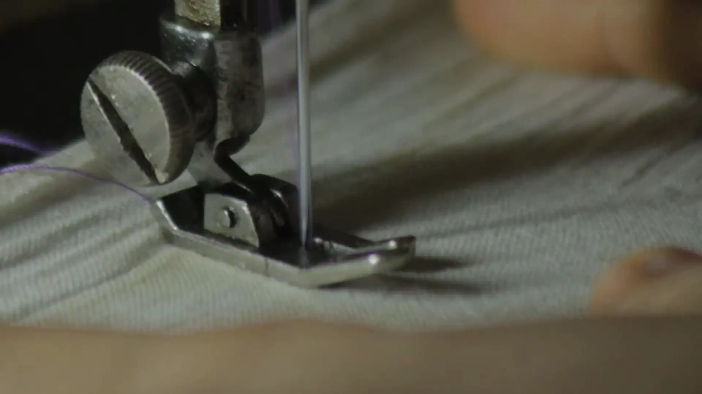

# План v4: тёмная тема по референсу клиентки

Запрос (2026-10-01): текущий дизайн остаётся **светлой темой** без изменений. Референс (тёмный цех на весь экран, тонкая антиква, лёгкий гротеск) становится **второй, тёмной темой**: «с этим оформлением, а другое всё оставь так же, шрифты возьми отсюда». План написан для исполнения по шагам; отступления записывать в `REPORT-v4.md`.

Референс: `materials/reference-dark.webp` (положить копию присланной картинки, шаг 0). Сравнение шрифтов: `screenshots/v4/font-match.png`.

---

## 0. Решения, принятые по умолчанию

Исполнитель делает так. Если заказчица скажет иначе, каждое решение меняется в одном месте (указано).

| # | Решение | Почему | Где поменять |
|---|---|---|---|
| Р1 | Тема переключается кнопкой в шапке (солнце/луна) и параметром `?theme=dark` / `?theme=light`. Выбор запоминается. По умолчанию **светлая**, системную тему не учитываем | Это два разных дизайна на выбор, а не «ночной режим»: светлая главная | `data-theme-default` на `<html>`, скрипт в `<head>` |
| Р2 | Шрифты референса только в тёмной теме. Светлая остаётся Playfair + Onest | «Это оставляй как светлую тему» | токены `--serif`, `--sans` в `theme-dark.css` |
| Р3 | **Тексты не меняются.** Те же элементы первого экрана раскладываются как в референсе (раздел 6) | «Другое всё оставь так же»; в референсе чужие тексты («СНГ», «Кейсы») | — |
| Р4 | Вертикальная лента «Рассчитать стоимость» в тёмной теме скрыта: её роль берёт кнопка-капсула в шапке, как в референсе | На фото во весь экран светлая лента выглядит чужой | одно правило в `theme-dark.css` |
| Р5 | Фото первого экрана: одна генерация Higgsfield 2K (стоит ровно 2 кредита, это весь остаток). Лучше: если у заказчицы есть исходник фона из референса без текста, поставить его | Сток Pexels/Unsplash по запросу «тёмный цех» даёт мало подходящего (проверено) | `assets/img/hero-dark-*.webp` |
| Р6 | Кнопки, поля и карточки квиза в тёмной теме со скруглением 8px, кнопка в шапке — капсула. Фото, секции и карточки карусели остаются прямоугольными | Так в референсе; правило формы записывается в `DESIGN.md` | токен `--radius-ctl` |
| Р7 | Бейдж справа внизу первого экрана с текстом «Профессиональный пошив одежды» перенесён из референса как декор (`aria-hidden`). Это единственный новый текст | Заказчице понравился именно этот вид | разметка `.hero-badge` |
| Р8 | Логотип остаётся брендовым (машинка + табличка), перекрашен в кремовый. Двухстрочный словесный знак из референса не вводим | Логотип — актив заказчицы | — |

---

## 1. Разбор референса (картинка 1280×853, размеры пересчитаны на нашу сетку 1200)

- **Фон:** фото цеха во всю ширину и высоту экрана, низкий ключ, тёплый свет из окна справа. Левые ~45% кадра почти чёрные (там текст), справа швея за машинкой, манекен, стойка с одеждой, рулоны ткани. Поверх градиент от тёмного слева к прозрачному справа и затемнение к низу.
- **Шапка (высота ≈ 96px):** прозрачная. Слева логотип, рядом навигация 14px, справа капсула с контуром «Рассчитать стоимость →» (высота 36–40) и бургер. Текст кремовый.
- **Надзаголовок:** прописные 12–13px, трекинг ≈ 0,32em, кремовый 70%.
- **Заголовок:** тонкая антиква ≈ 72px на 1280 (у нас 92px на 1440), интерлиньяж ≈ 0,98, три строки.
- **Подзаголовок:** гротеск Light 22px. **Лид:** гротеск Light 15px / 1,5, кремовый 85%.
- **Кнопка:** кремовая заливка, тёмный текст 14–15px, скругление ≈ 8px, высота 44, стрелка →.
- **Ряд из 4 преимуществ** у нижнего края: тонкая линейная иконка 22px над подписью 13px в 2–3 строки, колонки ≈ 145px.
- **Бейдж:** тонкая окружность ≈ 124px (линия кремовая 50%), внутри две строки прописными 11px, из центра вниз тонкая вертикальная линия, будто нить.
- **Цвета:** почти чёрный тёплый (#0E0B09…#1A1410), кремово-белый текст (#EEE6D8), приглушённая олива и беж в кадре. Цветного акцента нет. Нашу «нитку» оставляем в виде `--clay-light` #D9A184 (раздел 4).

---

## 2. Механика темы

### 2.1 Где хранится тема
- Атрибут `data-theme="light|dark"` на `<html>`. Все правила тёмной темы лежат в **новом** файле `theme-dark.css`, каждое начинается с `:root[data-theme="dark"]`. Файлы светлой темы (`styles.css`, `v3.css`) правятся только там, где без этого никак (раздел 4.3), и так, чтобы светлая отрисовка не изменилась ни на пиксель.
- В модулях `kc-*` блок тёмных токенов кладётся **внутрь** файла модуля (`modules/kc-*.css`, в конце), чтобы модуль оставался самодостаточным для Тильды.

### 2.2 Скрипт в `<head>` (до стилей, без мигания)
Сразу после `<meta name="theme-color">` вставить инлайн-скрипт, он заменяет нынешний `<script>document.documentElement.classList.add("js")</script>`:

```html
<script>
(function () {
  var d = document.documentElement, t = null, KEY = 'ks-theme';
  try {
    var q = new URLSearchParams(location.search).get('theme');
    if (q === 'dark' || q === 'light') localStorage.setItem(KEY, q);
    t = q || localStorage.getItem(KEY);
  } catch (e) {}
  if (t !== 'dark' && t !== 'light') t = d.getAttribute('data-theme-default') || 'light';
  d.setAttribute('data-theme', t);
  d.classList.add('js');
  var m = document.querySelector('meta[name="theme-color"]');
  if (m) m.content = t === 'dark' ? '#14100D' : '#E6DECE';
  // предзагрузка картинки первого экрана и шрифтов только активной темы
  var P = t === 'dark'
    ? [['image', 'assets/img/hero-dark-1920.webp', 'assets/img/hero-dark-m.webp 864w, assets/img/hero-dark-1280.webp 1280w, assets/img/hero-dark-1920.webp 1920w'],
       ['font', 'assets/fonts/noto-serif-sc-cyrillic-normal.woff2'], ['font', 'assets/fonts/inter-cyrillic-wght-normal.woff2']]
    : [['image', 'assets/img/img-01.webp'],
       ['font', 'assets/fonts/playfair-display-cyrillic-wght-normal.woff2'], ['font', 'assets/fonts/onest-cyrillic-wght-normal.woff2']];
  P.forEach(function (p) {
    var l = document.createElement('link'); l.rel = 'preload'; l.as = p[0]; l.href = p[1];
    if (p[0] === 'font') { l.type = 'font/woff2'; l.crossOrigin = ''; } else { l.fetchPriority = 'high'; }
    if (p[2]) { l.imageSrcset = p[2]; l.imageSizes = '100vw'; }
    document.head.appendChild(l);
  });
})();
</script>
```

- Статические `<link rel="preload">` для шрифтов и `img-01` из `<head>` убрать: их теперь ставит скрипт по теме. Без JS страница светлая и грузится как обычно.
- У `` арки (слот 01) убрать `fetchpriority="high"` и поставить `loading="lazy"`: в светлой теме его заранее грузит preload из скрипта, в тёмной он скрыт и не скачивается. **Проверка:** LCP светлой темы в Lighthouse не хуже текущего (±100 мс). Если хуже, вернуть eager и принять лишние 54 КБ в тёмной теме.
- `color-scheme: dark` на `:root[data-theme="dark"]` (полосы прокрутки, автозаполнение полей).

### 2.3 Переключатель
- Кнопка 44×44 `.theme-toggle.icon-btn` с `data-theme-toggle`, `aria-label="Тёмная тема"`, `aria-pressed="true|false"` (нажата = тёмная). Две иконки Phosphor Light (`moon-light`, `sun-light`): в светлой видна луна, в тёмной солнце.
- Места: на десктопе последним элементом в `.nav-right` (после телефона); на мобильном первым в `.header-mobile` (перед телефоном). Обе кнопки синхронны.
- Новый файл `theme.js` (defer):
  - клик → `setTheme(next)`: `document.startViewTransition` (если есть и нет reduced motion, иначе сразу), `data-theme`, `localStorage`, `meta[theme-color]`, `aria-pressed` у всех `[data-theme-toggle]`, событие `document.dispatchEvent(new CustomEvent('themechange', { detail: { theme } }))`;
  - сплошная шапка в тёмной теме (раздел 5): `IntersectionObserver` на `.hero` с `rootMargin: -${header-h}px 0 0 0` → класс `.is-solid` на `.site-header`;
  - кроссфейд view transition 280 мс (`::view-transition-old(root), ::view-transition-new(root) { animation-duration: .28s }`).
- `v3.js` слушает `themechange`: в тёмной теме ткань (`initFabric`) не запускается и останавливается (`stop()`, `cv.classList.remove('is-on')`); при возврате в светлую стартует заново. При первой загрузке в тёмной теме `initFabric` сразу выходит.

### 2.4 Превью для заказчицы
- `tools/preview.mjs` получает флаг `--theme=dark`: ставит `data-theme-default="dark"` на `<html>` в собранном файле. Скрипты: `npm run preview` → `preview.html` (светлая), `npm run preview:dark` → `preview-dark.html`. В обоих файлах есть переключатель.
- Ссылка с параметром тоже работает с диска: `index.html?theme=dark`.

---

## 3. Файлы

| Файл | Что |
|---|---|
| `theme-dark.css` (новый) | шрифты тёмной темы, токены, переопределения, шапка, первый экран, радиусы; подключить **после** `v3.css` |
| `theme.js` (новый) | переключатель, сплошная шапка, событие `themechange` |
| `index.html` | скрипт в `<head>`, переключатели, кнопка-капсула в шапке, фон и бейдж первого экрана, 4-й факт и иконки фактов (раздел 6.2) |
| `v3.js` | реакция на `themechange` для ткани |
| `modules/kc-*.css` | захардкоженные цвета → токены модуля (светлые значения те же), в конце блок тёмных токенов |
| `assets/fonts/` | `noto-serif-sc-{cyrillic,latin}-{normal,italic}.woff2`, `inter-{cyrillic,latin}-wght-normal.woff2` |
| `assets/img/` | `hero-dark-1920.webp`, `hero-dark-1280.webp`, `hero-dark-m.webp` (+ `.json` с происхождением) |
| `assets/icons/phosphor-light.svg` (новый, спрайт) | `factory`, `timer`, `scissors`, `package`, `sun`, `moon`, `arrow-right`; пути скопированы из `@phosphor-icons/core/assets/light/*.svg` (не рисовать вручную) |
| `tools/visual-diff.mjs` (новый) | попиксельное сравнение двух PNG (sharp raw): доля отличающихся пикселей + картинка-разница |
| `tools/e2e.mjs` | параметр `--theme=dark`, новые тесты (раздел 10) |
| `tools/shots-v3.mjs` | параметр `--theme=dark` → `screenshots/v4-dark/` |
| `tools/preview.mjs` | флаг `--theme=dark` |
| `tools/subset-fonts.sh` | добавить шрифты тёмной темы (раздел 3.1) |
| `package.json` | devDeps `@fontsource-variable/noto-serif`, `@fontsource-variable/inter`, `@phosphor-icons/core`; скрипты `e2e:dark`, `shots:dark`, `preview:dark`, `diff` |
| Документы | `DESIGN.md` (раздел «v4: тёмная тема»), `README.md`, `CREDITS.md`, `REPORT-v4.md` |

### 3.1 Шрифты: как получить файлы

Подбор сделан сравнением с референсом по ширине строки и рисунку букв (`screenshots/v4/font-match.png`). Кандидаты и почему отказ: Spectral, Literata, Source Serif 4, Merriweather, Roboto Serif — шире и ниже; Noto Serif Display — слишком контрастная; Cormorant — маленький x-height. Гротеск: Inter совпадает по «д», «а», «з» и ширине; Manrope и Onest уже и геометричнее.

| Роль | Гарнитура | Начертание | Где |
|---|---|---|---|
| Дисплей | **Noto Serif**, ширина 87,5% (SemiCondensed), «запечённая» | 300–500, обычный и курсив | h1–h3, цифры фактов, цитата, бегущая строка, телефон |
| Текст и интерфейс | **Inter** (вариативный) | 300–600 | абзацы, кнопки, меню, формы, подписи, модули |
| Ярлыки | Inter прописными | 500, трекинг .12–.32em | вместо IBM Plex Mono: `.tag`, номера, `.step-n`, счётчик, надзаголовок |

Команды (venv с fonttools и brotli уже собирался: `python3 -m venv .venv && .venv/bin/pip install fonttools brotli`):

```bash
NS=node_modules/@fontsource-variable/noto-serif/files
for s in normal italic; do
  for sub in cyrillic latin; do
    .venv/bin/fonttools varLib.instancer $NS/noto-serif-$sub-standard-$s.woff2 wdth=87.5 wght=300:500 \
      --output=/tmp/ns-$sub-$s.woff2
  done
  cp /tmp/ns-cyrillic-$s.woff2 assets/fonts/noto-serif-sc-cyrillic-$s.woff2
  # latin урезать до символов сайта тем же списком, что в subset-fonts.sh
  .venv/bin/pyftsubset /tmp/ns-latin-$s.woff2 --unicodes="$U" --flavor=woff2 --layout-features='kern,liga,lnum,pnum,tnum,case,ccmp,locl,mark,mkmk' \
    --output-file=assets/fonts/noto-serif-sc-latin-$s.woff2
done
cp node_modules/@fontsource-variable/inter/files/inter-cyrillic-wght-normal.woff2 assets/fonts/
.venv/bin/pyftsubset node_modules/@fontsource-variable/inter/files/inter-latin-wght-normal.woff2 --unicodes="$U" --flavor=woff2 \
  --layout-features='kern,liga,lnum,pnum,tnum,case,ccmp,locl,mark,mkmk,calt,ss01' --output-file=assets/fonts/inter-latin-wght-normal.woff2
```

Ожидаемый вес (проверено на кириллице): Noto Serif SC обычный ≈ 18,5 КБ, курсив ≈ 23 КБ, Inter cyrillic ≈ 19 КБ. Светлая тема их не скачивает: браузер грузит `@font-face` только когда шрифт реально используется.

`@font-face` в `theme-dark.css`: семьи `"Noto Serif SC"` (weight `300 500`, style normal/italic) и `"Inter"` (weight `300 600`), `font-display: swap`, `unicode-range` как у Playfair/Onest в `styles.css`.

### 3.2 Шкала тёмной темы (px по брейкпоинтам Tilda)

| Роль | 1600+ | 1200+ | 960 | 640 | 480 | 320 |
|---|---|---|---|---|---|---|
| Заголовок первого экрана (Noto Serif 330) | 104 | 92 | 76 | 60 | 50 | 42 |
| Надзаголовок (Inter 400, прописные, .32em) | 14 | 13 | 13 | 12 | 11 | 11 |
| Подзаголовок (Inter 300) | 24 | 22 | 21 | 19 | 18 | 18 |
| Лид (Inter 300) | 17 | 16 | 16 | 15 | 15 | 15 |
| h2 (Noto Serif 300) | 64 | 56 | 48 | 40 | 34 | 30 |
| h2 доверия («Олеся Аксенова») | 72 | 64 | 54 | 46 | 40 | 34 |
| h3 (Noto Serif 400) | 36 | 32 | 28 | 26 | 24 | 22 |
| Цитата (Noto Serif 300 курсив) | 38 | 34 | 30 | 27 | 24 | 22 |
| Цифра факта (Noto Serif 300) | 50 | 44 | 40 | 36 | 34 | 30 |
| Тело (Inter 400) | 18 | 17 | 17 | 16 | 16 | 16 |
| Малый (Inter 400) | 15 | 14 | 14 | 14 | 13 | 13 |
| Кнопки (Inter 500) | 16 | 15 | 15 | 15 | 15 | 15 |

Значения кладутся в те же токены `--fs-*` внутри `:root[data-theme="dark"]` (и в медиазапросах), чтобы вся раскладка светлой темы работала без изменений. Начертания: `h1, h2 { font-weight: 300 }`, `h3 { 400 }`, первый экран 330. Межстрочные: дисплей .98–1.06, текст 1.55.

---

## 4. Палитра и токены

### 4.1 Значения

| Токен | Светлая | Тёмная | Роль в тёмной |
|---|---|---|---|
| `--linen` | #E6DECE | **#14100D** | фон страницы |
| `--milk` | #F2ECE2 | **#1D1713** | поверхность: «Основатель», «Задачи», карточки, поля, окна |
| `--cacao` | #2A1810 | **#0B0907** | глубокие полосы: бегущая строка, «Что мы шьём», финал |
| `--ink` | #2E2520 | **#EEE6D8** | текст; заливка главной кнопки |
| `--ink-hover` | #4A3B33 | **#FBF6EE** | наведение на главную кнопку |
| `--muted` | #6B5F55 | **#A89D90** | второстепенный текст (7,1:1 на фоне, 6,7:1 на поверхности) |
| `--clay` | #974B31 | **#D9A184** | «нитка»: строчка, фокус, акцентное слово, `.step-n` (8,4:1) |
| `--line` | rgba(46,37,32,.18) | **rgba(238,230,216,.14)** | линии |
| `--line-strong` | rgba(46,37,32,.56) | **rgba(238,230,216,.40)** | контуры полей и кнопок |
| `--olive` | #5E6A48 | **#9DAA7F** | пунктир подсказки |
| `--sage-bg` | #E4E8DC | **#22261C** | фон подсказки |
| `--mustard-ink` | #765A1F | **#D8B866** | пометки `[уточнить]` |
| `--weave-light` | сетка ink 2,8% | **сетка (238,230,216) 2,5%** | переплетение на тёмном |
| `--radius-ctl` (новый) | 0 | **8px** | кнопки, поля, карточки квиза, чипы |
| `--serif` / `--sans` / `--mono` | Playfair / Onest / Plex | **Noto Serif SC / Inter / Inter** | — |

Кремовая кнопка с тёмным текстом получается сама: `.btn-primary { background: var(--ink); color: var(--milk) }` → #EEE6D8 / #1D1713 (14:1), как в референсе.

### 4.2 Места, которые после подмены токенов сломаются (найдено grep'ом, все исправить в `theme-dark.css`)

Тёмные полосы светлой темы пишут текст цветом `--milk`, а в тёмной теме `--milk` стал тёмным:

1. `.final`, `.s-portfolio`, `.marquee` → `color: var(--ink)`.
2. `.btn-on-dark` → `background: var(--ink); color: var(--cacao); border-color: var(--ink)`; hover `--ink-hover`.
3. `.btn-on-dark-outline` → `color: var(--ink); border-color: rgba(238,230,216,.5)`.
4. Обводки фокуса `outline-color: var(--milk)`: `.final :focus-visible`, `.marquee-pause:focus-visible`, `.final-phone:focus-visible`, `.tape:focus-visible`, `.s-portfolio … :focus-visible` → `var(--ink)`.
5. `.final-direct a`, `.final-direct a:hover` → `color/text-decoration-color: var(--ink)`.
6. `.s-portfolio .sec-head h2`, `.kc-carousel__goto`, `__counter`, `__arrow` (v3.css 123–131) → `var(--ink)`.
7. `.marquee-pause` → `color: var(--ink)`, фон `var(--cacao)`, hover `rgba(238,230,216,.1)`.
8. `.fact--main .fact-l` (rgba(242,236,226,.82) на кремовой карточке пропадёт) → `rgba(29,23,19,.72)`.
9. Галочки чекбоксов: `.check input:checked`, `.kc-calc__check input:checked`, `.kc-calc__item input:checked + .kc-calc__thumb::after` — фон `--ink` стал кремовым, а галочка в SVG светлая (`%23F2ECE2`). Подменить `background-image` на SVG со штрихом `%231D1713`.
10. Стрелка в `.field select` (SVG со штрихом `%232E2520`) → штрих `%23EEE6D8`.
11. `dialog::backdrop` → `rgba(0,0,0,.72)`.
12. `html { scrollbar-color }` → `rgba(238,230,216,.3) var(--linen)`.
13. Подложки фото `#C9B79C` (`.hero-arch`, `.prod-photo`) и заглушек `#D5C8B3` → `#2A221C`.
14. `.window` (тёмная рамка `--cacao` на `--milk`): оставить, тень `--clay` автоматически станет #D9A184; уменьшить до 6px, иначе слишком ярко.
15. `.logo-plate` (фон `--linen`, рамка `--ink`) работает сам: тёмная табличка, кремовая рамка и текст. Над прозрачной шапкой фон таблички → `transparent`.
16. Фото слотов: к фильтру `saturate(.92) sepia(.06)` добавить `brightness(.92)`, чтобы светлые кадры не «светили» на тёмном.
17. `.hero-facts .acc` в тёмной теме → `font-style: normal; color: inherit` (в референсе подписи без курсива).
18. `.ht-city::before` (строчка перед «в Челябинске») → `display: none`.
19. `::selection` → фон `--clay`, текст `#14100D`.

### 4.3 Модули `kc-*`

Сначала (без изменения светлой отрисовки) перевести захардкоженные цвета в токены модуля:

| Модуль | Было | Новый токен (светлое значение = прежнее) |
|---|---|---|
| carousel | `rgba(242,236,226,.99)` фон карточки | `--kc-card-bg` (**альфа .99 сохранить**, см. `DESIGN.md` про Chromium) |
| carousel | `rgba(201,183,156,.99)` фон медиа | `--kc-media-bg` |
| carousel, calc | `rgba(46,37,32,.08)` hover | `--kc-hover` |
| tasks, calc | `#765A1F` | `--kc-todo` |
| tasks, calc | `#C9B79C`, `#D5C8B3` | `--kc-ph-bg` |
| calc | `rgba(46,37,32,.5/.7)` мерная лента | `--kc-tick`, `--kc-tick-strong` |
| calc | галочки SVG | `--kc-check-img` |

Затем в конец каждого файла модуля блок `:root[data-theme="dark"] .kc-… { … }` со значениями из 4.1 плюс `--kc-card-bg: rgba(29,23,19,.99)`, `--kc-media-bg: rgba(42,34,28,.99)`, `--kc-hover: rgba(238,230,216,.1)`, шрифтами `--kc-serif`, `--kc-sans`, `--kc-mono` и радиусом. В v3.css переопределения `.s-portfolio .kc-…` покрыты пунктом 6.

---

## 5. Шапка (тёмная)

- Высота 88 / 88 / 64 / 60 / 60 (как сейчас ниже 960).
- Раскладка ≥960: `grid-template-columns: auto 1fr auto`: логотип слева; `.nav-left` и `.nav-right` идут подряд одной строкой (Услуги, Производство, Портфолио, Прайс, Контакты, телефон) с отступом 32px от логотипа; справа переключатель темы и **новая** кнопка-капсула `.header-cta` («Рассчитать стоимость →», ссылка `#raschet`, `data-calc-*` не нужен). В светлой теме `.header-cta { display: none }`.
  Порядок DOM: `nav-left`, `logo`, `nav-right` → в тёмной логотип ставится первым через `order`/`grid-area`; порядок табуляции остаётся DOM-ным. Это допустимо (логотип — ссылка «в начало», первым по табу идёт «Услуги»), но проверить, что фокус-обводка видна.
- Навигация Inter 400 14px, телефон Inter 500. Капсула: высота 40, отступы 0 20px, рамка `1px rgba(238,230,216,.5)`, `border-radius: 999px`, hover фон `rgba(238,230,216,.1)`, стрелка — иконка `arrow-right` 16px.
- **Прозрачная на первом экране, сплошная после него.** Над фото: фон `transparent`, без нижней линии, плюс мягкий градиент сверху `linear-gradient(rgba(12,9,7,.55), transparent)` на `::before` высотой 140px, чтобы навигация читалась на любом кадре. `.is-solid` (ставит `theme.js`, раздел 2.3): фон `rgba(20,16,13,.92)`, `backdrop-filter: blur(12px)`, нижняя линия `--line`, переход 250 мс. Под шапкой при этом никогда нет текста (жалоба на прозрачную шапку из v2 не повторяется).
- Нитка прогресса — цвет `--clay` (уже #D9A184).
- Вертикальная лента `.tape` → `display: none` (Р4). Мобильная липкая кнопка остаётся: тёмная полоса, кремовая кнопка.
- Мобильное меню: фон `--linen` (тёмный), пункты Noto Serif 300 34px.

---

## 6. Первый экран (тёмный)

### 6.1 Раскладка тех же текстов

| Референс | У нас (тот же DOM) |
|---|---|
| надзаголовок «ШВЕЙНОЕ ПРОИЗВОДСТВО ПОЛНОГО ЦИКЛА» | `.ht-xl` + `.ht-city` одной строкой: **«ШВЕЙНОЕ ПРОИЗВОДСТВО В ЧЕЛЯБИНСКЕ»** (оба `display: inline`, пробел уже есть в DOM) |
| заголовок «Шьём одежду для брендов и бизнеса» | `.ht-mid`: **«Полного цикла под ключ»**, «под ключ» курсивом Noto Serif цвета `--clay` |
| подзаголовок «От образца до серийного производства» | первый `span` лида: «Шьём для локальных брендов и селлеров WB и OZON.» (22px Light) |
| лид | второй `span`: «Доставка по всей России.» (16px, 85%) |
| кнопка «Рассчитать стоимость проекта →» | «Рассчитать стоимость» + стрелка-иконка; рядом контурная «Скачать прайс» |
| 4 преимущества с иконками | 3 факта из `.hero-facts` + 4-й «от 300 ед. / опт для WB и OZON» (тексты уже есть в экране 2) |
| бейдж | «Профессиональный пошив одежды» (Р7) |

H1 для поиска и скринридера читается как сейчас: «Швейное производство в Челябинске Полного цикла под ключ».

### 6.2 Изменения разметки (`index.html`)

1. В `.hero` первым ребёнком (до `canvas`):
   ```html
   <picture class="hero-bg" aria-hidden="true">
     <source media="(max-width: 639px)" srcset="assets/img/hero-dark-m.webp">
     
   </picture>
   ```
   В светлой теме `.hero-bg { display: none }` (с `loading="lazy"` не скачивается).
2. В `dl.hero-facts` четвёртый пункт `<div class="hero-fact--opt"><dt>от&nbsp;300&nbsp;ед.</dt><dd>опт для&nbsp;WB и&nbsp;OZON</dd></div>`, в светлой теме `display: none`. В тёмной скрыть `.hero-actions .tag`. Каждому из четырёх пунктов иконка `<svg class="hf-ico" aria-hidden="true"><use href="assets/icons/phosphor-light.svg#factory"/></svg>` (factory, timer, scissors, package), в светлой теме скрыта. Проверить, что `<use>` внешнего спрайта работает с `file://` в превью; если нет, спрайт встроить в начало `<body>` рядом с `#mark`.
3. После `.hero-grid`: `<div class="hero-badge" aria-hidden="true"><span>Профессиональный<br>пошив одежды</span></div>`, в светлой теме скрыт.
4. В шапке: `.header-cta` и два переключателя (раздел 2.3, 5).

### 6.3 Стили (≥1200, база 1440×900)

- `.hero`: `min-height: min(100dvh, 960px)`, `padding: calc(var(--header-h) + 72px) 0 48px`, `display: grid; align-content: end`, фон `#0B0907`.
- В тёмной теме скрыть `.fabric`, `.hero-media` (арка, карточка, печать).
- `.hero-bg`: `position: absolute; inset: 0; z-index: -2`; `img { width:100%; height:100%; object-fit: cover; object-position: 62% 50% }`.
  `::after` (`z-index: -1`):
  `linear-gradient(90deg, rgba(12,9,7,.92) 0%, rgba(12,9,7,.80) 30%, rgba(12,9,7,.40) 56%, rgba(12,9,7,.12) 100%), linear-gradient(180deg, rgba(12,9,7,.50) 0%, rgba(12,9,7,0) 22%, rgba(12,9,7,0) 60%, rgba(12,9,7,.88) 100%)`.
- `.hero-text`: колонки 1–7 из 12, `max-width: 640px`.
- Надзаголовок (`.ht-xl`, `.ht-city` внутри h1): Inter 400 13px, `text-transform: uppercase`, `letter-spacing: .32em`, цвет `rgba(238,230,216,.72)`, `margin-bottom: 28px`.
- `.ht-mid`: Noto Serif SC 330, 92px / .98, `letter-spacing: -.005em`, цвет `--ink`, `display: block`. Курсив «под ключ»: проверить хвост «ю» и «ч» (правило про выносные элементы курсива: `padding-bottom: .08em`).
- Лид: первый `span` Inter 300 22px / 1.3 `--ink`, `margin-top: 28px`; второй `span` Inter 300 16px / 1.5 `rgba(238,230,216,.85)`, `margin-top: 18px`.
- `.hero-actions`: `margin-top: 36px`, кнопки высотой 52, радиус `--radius-ctl`; главная кремовая со стрелкой-иконкой справа (16px, отступ 18px); «Скачать прайс» — контур `rgba(238,230,216,.5)`, текст `--ink`.
- `.hero-facts` → ряд преимуществ: `margin-top: 72px`, `display: grid; grid-template-columns: repeat(4, minmax(0, 168px)); gap: 32px`, без пунктирных разделителей. Пункт: иконка 24px (`stroke: currentColor`, цвет `rgba(238,230,216,.9)`), под ней через 14px `dt` Inter 500 15px `--ink` (без курсива и цвета), `dd` Inter 300 13px / 1.4 `rgba(238,230,216,.72)`, без прописных.
- `.hero-badge`: `position: absolute; right: max(var(--gutter), calc((100vw - var(--container)) / 2 + var(--gutter))); bottom: 56px`, круг 128px, рамка `1px rgba(238,230,216,.5)`, `border-radius: 50%`, текст Inter 500 10,5px прописными, `letter-spacing: .14em`, по центру. `::after`: линия 1px × 64px от середины вниз, цвет `rgba(238,230,216,.6)`. Анимация «нить стекает» `scaleY 0→1`, `transform-origin: top`, 2,4 с, бесконечно, пауза 1,2 с; при reduced motion статична.
- Появление: строки h1 и лид — существующая анимация `rise`; фото — `opacity 0→1` и `scale 1.04→1` за 1,2 с; при reduced motion без анимации.

### 6.4 Адаптив

| Ширина | Что меняется |
|---|---|
| 1600+ | сетка 1360, кегли по таблице 3.2, бейдж 140px |
| 960–1199 | бейдж 112px; преимущества `repeat(4, minmax(0, 1fr))` |
| ≤959 | `.hero { min-height: 100svh; align-content: end; padding-bottom: 32px }`, `object-position: 72% 50%`, градиент сверху вниз `rgba(12,9,7,.45) 0, .30 28%, .80 58%, .95 100%`; бейдж скрыт; преимущества 2×2, `gap: 20px 16px` |
| ≤639 | `<source>` с портретным кадром `hero-dark-m.webp`; кнопки во всю ширину; надзаголовок 11–12px, `.22em` |
| 320 | «Полного цикла» 42px помещается в 288px (проверить тестом без горизонтальной прокрутки) |
| высота ≤760 при ≥960 | заголовок 76px, отступы −30%, весь экран с рядом преимуществ виден на 1366×650 |

---

## 7. Фото первого экрана

### 7.1 Источник
1. **Если заказчица пришлёт исходник фона из референса** (без текста, ≥1920px) — взять его, пропустить 7.2.
2. Иначе одна генерация Higgsfield: модель `nano_banana_2`, `aspect_ratio: "16:9"`, `resolution: "2k"`, стоимость 2 кредита (проверено `get_cost`, на счёте ровно 2). Повторить нельзя, поэтому промпт выверен заранее:

> Cinematic wide photograph of a real garment sewing atelier interior at golden hour, low-key warm lighting. A tall industrial window on the far right lets in soft daylight with visible dust in the light beams. Background: plaster and brick wall with pinned fashion sketches and paper patterns, a tailor's dress form mannequin with a yellow tape measure around the neck, a rolling clothing rack with muted garments in black, beige and olive. Right-center middle ground: a female seamstress seen from behind and slightly from the side, hair in a low bun, dark linen shirt, working at an industrial lockstitch sewing machine, unbranded machine with no visible text or logos. Foreground right: wooden cutting table with folded olive and black fabric, two rolls of beige fabric, tailor's shears, pattern drawings on paper. The left 45% of the frame falls into deep shadow, almost black, with softly blurred dark garments, intentionally empty for text overlay. Palette: deep espresso browns, warm off-white highlights, muted olive. Shot on 35mm, f/2.8, shallow depth of field, subtle film grain, photorealistic editorial interior photography. No text, no letters, no watermark, no brand names, no logos, no faces looking at camera.

3. Если результат с дефектами (лишние пальцы, буквы, логотип на машинке, светлая левая часть) — не генерировать заново (нет кредитов): кадрировать или затемнить проблемное место; если не спасается, запасной путь — сток через песочницу Higgsfield (Pexels/Unsplash по запросам `dark sewing workshop window light`, `seamstress industrial sewing machine moody`, `tailor atelier dark interior`), лицензия Pexels/Unsplash, запись в `CREDITS.md`.

### 7.2 Перенос в репозиторий (проверенный путь)
Прямые адреса картинок (cloudfront) прокси не пускает. Работает перенос текстом через песочницу Higgsfield (`sandbox_exec`) с построчной проверкой md5 (`gen/check.py`, `gen/build.py` в scratchpad, формат строки `индекс md5_6 400-символьный-кусок`).
- Файлы песочницы живут ~10 с после вызова, поэтому каждый вызов заново скачивает PNG и кодирует его **одинаково** (детерминированно), печатает только свой диапазон строк, первой строкой `FULLMD5`; FULLMD5 должен совпасть во всех вызовах.
- Мастер: `1920×1080 WebP q60` (Pillow, `method=6`), цель ≤ 110 КБ ≈ 150 тыс. символов base64 ≈ 375 строк → 5 вызовов по 75 строк (≈ 30 тыс. символов, ниже порога обрезки вывода ~40 тыс.).
- Локально из мастера (`sharp`): `hero-dark-1920.webp` (q58), `hero-dark-1280.webp` (q60), `hero-dark-m.webp` — портретный кадр 864×1080 по правой части (швея), q60. Рядом `.json` с промптом, моделью, датой, `credits: 2`.

---

## 8. Остальные экраны (меняются только цвет, шрифт и радиус элементов управления)

| Экран | Тёмная тема |
|---|---|
| Бегущая строка | фон `--cacao`, линии `--line` сверху и снизу, Noto Serif SC курсив 300, разделитель — строчка `--clay` |
| Производство | фон `--linen`; главный факт кремовый с тёмным текстом и тенью `--clay` 6px; остальные `--milk` с пунктиром `--clay` |
| Основатель | фон `--milk`; фото Олеси в рамке `--cacao`; цитата курсивом Noto Serif |
| Что мы шьём | фон `--cacao`; карточки `--kc-card-bg` (#1D1713, .99), подпись кремовая, кнопка «Рассчитать» контурная кремовая; 3D и закольцовка без изменений |
| Шов | фон `--linen`, полоса `--milk` с двумя строчками `--clay` |
| Задачи | фон `--milk`; названия Noto Serif SC 300; стрелки `--clay` |
| Путь и квиз | фон `--linen`; бейджи шагов `--clay` с тёмным текстом; карточки, чипы и поля `--milk` с контуром `--line-strong` и радиусом 8; панель «Ваш проект» `--milk` |
| Финал | фон `--cacao`; кнопки по пункту 4.2.2–3; плашка с телефоном — пунктир `--clay` |
| Подвал | фон `--linen`, телефон `--clay` |
| Окна (прайс, «Обсудить задачу», меню) | `--milk`, подложка rgba(0,0,0,.72), поля с радиусом 8 |

Необязательно, делать в последнюю очередь, если всё остальное готово: финал с тем же кадром цеха, затемнённым на 88% (`::before`, `background-image` из уже загруженного `hero-dark-1280.webp`). Это «рамка» страницы, как первый экран.

---

## 9. Движение тёмной темы

Остаётся всё из v3 (нитка прогресса, раскрытие фото, параллакс, строчка пути, появление блоков, бегущая строка). Отличия: ткань WebGL выключена, добавлены проявление фото первого экрана (1,2 с), «нить» бейджа и кроссфейд смены темы (280 мс). Всё гасится при `prefers-reduced-motion`.

---

## 10. Проверка

### 10.1 Светлая тема не изменилась (главный риск)
- **До любых правок** снять эталон с текущего коммита при reduced motion: страница целиком 1440 и 390, первый экран 1920×1080 и 1366×650 → `screenshots/v4/light-baseline/`.
- `tools/visual-diff.mjs a.png b.png [diff.png]`: пиксель отличается, если разница любого канала > 8; печатает долю. При сравнении в обе страницы вставлять `.theme-toggle, .header-cta { display: none !important }`.
- Критерий: доля ≤ 0,05% на каждом кадре. Запускать после каждого шага из раздела 12.

### 10.2 e2e (`tools/e2e.mjs`)
- `--theme=dark` → ко всем адресам добавляется `?theme=dark`; тесты стилей светлой темы помечены `light:` и в тёмном прогоне пропускаются, тесты `dark:` — наоборот. Функциональные тесты (квиз и предвыбор, карусель, задачи, окна, меню, липкая кнопка, горизонтальная прокрутка на 10 ширинах, консоль) идут в обеих темах.
- Новые тесты:
  1. Переключатель: клик → `data-theme="dark"`, `aria-pressed="true"` у обеих кнопок, `localStorage['ks-theme']`; после перезагрузки тема та же; `?theme=light` перебивает сохранённую.
  2. Без мигания: `addInitScript` записывает фон `<html>` в первом `requestAnimationFrame`; при сохранённой тёмной он тёмный.
  3. Шрифты тёмной: h1 `Noto Serif SC`, абзац и кнопка `Inter`, `.tag` `Inter`; оба загружены. В светлой теме эти шрифты **не** загружены.
  4. Первый экран: `.hero-bg img` загружен (`naturalWidth > 0`), `.hero-media` и `.fabric` скрыты, ткань не запущена; 4 пункта фактов с иконками; `.tag` скрыт; бейдж виден на ≥960 и скрыт ниже.
  5. Шапка: наверху прозрачная (альфа фона < .2), после прокрутки ниже первого экрана альфа ≥ .9; `.header-cta` ведёт на `#raschet`, виден на ≥960; лента `.tape` скрыта; в светлой теме прежний тест «шапка всегда непрозрачная» проходит.
  6. **Аудит контраста** по всей странице в тёмной теме: для каждого видимого элемента с собственным текстом найти первый непрозрачный фон по предкам и проверить ≥ 4,5:1 (≥ 3:1 для текста ≥ 24px). Текст первого экрана поверх фото проверяется по скриншоту: сделать текст прозрачным, взять самый светлый пиксель под рамкой текста, сравнить с цветом текста.
  7. Галочка чекбокса видна: у отмеченного чекбокса в квизе и в окне прайса пиксель в центре отличается от фона больше чем на 40 по яркости.
  8. Фокус виден: у кнопки, ссылки, поля и капсулы в шапке `outline-color` с контрастом ≥ 3:1 к фону.
- `package.json`: `"e2e:dark": "node tools/e2e.mjs --theme=dark"`.

### 10.3 Скриншоты и Lighthouse
- `node tools/shots-v3.mjs --theme=dark` → `screenshots/v4-dark/`: первый экран на 7 окнах (1920×1080, 1440×900, 1366×650, 1024×768, 768×1024, 390×844, 360×640), экраны на 1440 и 390, страница целиком. Просмотреть каждый кадр.
- Lighthouse (сервер со сжатием из scratchpad `gz.mjs`, порт 5508): тёмная `?theme=dark` мобильный ≥ 90, десктоп ≥ 98, доступность 100; светлая не хуже текущей (89–93 / 100).

---

## 11. Документы и Тильда

- `DESIGN.md`: раздел «v4: тёмная тема» — механика, таблица токенов 4.1, шкала 3.2, правило формы (Р6), шапка, первый экран, Do/Don't.
- `README.md`: как переключать (кнопка, `?theme=dark`), превью, новые скрипты.
- `CREDITS.md`: Noto Serif (Google, OFL 1.1), Inter (Rasmus Andersson, OFL 1.1), Phosphor Icons (MIT), фото `hero-dark-*` (происхождение по 7.1).
- `REPORT-v4.md`: что сделано, отступления, проверки.
- **Тильда:** переключить тему с разными шрифтами и разным первым экраном штатно нельзя. Заказчица выбирает одну тему для запуска, либо тёмная собирается отдельной страницей (свои Zero Block и шрифты в настройках страницы). Модули `kc-*` переносятся вместе с тёмными токенами: они привязаны к `:root[data-theme="dark"]`, поэтому на тёмной странице Тильды в первый блок T123 добавить `<script>document.documentElement.dataset.theme = 'dark'</script>`. Записать это в README.

---

## 12. Порядок работ (коммит после каждого шага)

| Шаг | Содержание | Готово, когда |
|---|---|---|
| 0 | Эталон светлой темы (10.1), `tools/visual-diff.mjs`, копия референса в `materials/` | эталон в `screenshots/v4/light-baseline/` |
| 1 | Механика: скрипт в `<head>`, `theme.js`, переключатели, пустой `theme-dark.css`, `?theme`, превью `--theme`, e2e `--theme` и тесты 1–2 | светлая разница ≤ 0,05%, все 83 теста светлой проходят |
| 2 | Шрифты (3.1), `@font-face`, токены шкалы 3.2 | тест 3 |
| 3 | Палитра 4.1, исправления 4.2, токенизация и тёмные блоки модулей 4.3 | аудит контраста (тест 6) без нарушений вне первого экрана; светлая разница ≤ 0,05% |
| 4 | Шапка (раздел 5) | тест 5 |
| 5 | Фото (7), первый экран (6), иконки | тест 4, контраст текста на фото, скриншоты 7 окон |
| 6 | Остальные экраны (8), радиусы, окна, меню, липкая кнопка | весь `e2e:dark` зелёный, скриншоты просмотрены |
| 7 | Lighthouse, документы, превью `preview.html` и `preview-dark.html`, отчёт, пуш, отправка заказчице | раздел 10 выполнен |

## 13. Риски

| Риск | Что делаем |
|---|---|
| Светлая тема незаметно поехала | эталон и попиксельное сравнение после каждого шага (10.1) |
| Генерация фото неудачная, а кредитов больше нет | кадрирование и затемнение; запасной путь — сток через песочницу (7.1) |
| `<use href="файл.svg#id">` не работает с `file://` в превью | встроить спрайт в страницу (6.2) |
| Прозрачная шапка снова «текст на тексте» | прозрачна только над фото первого экрана, ниже сплошная (раздел 5), тест 5 |
| Лишние килобайты светлой теме | шрифты тёмной не используются → не грузятся; фото тёмной `lazy` и скрыто; проверка в тесте 3 и в Lighthouse |
| `view-transition` в старых браузерах | без поддержки тема меняется сразу |
